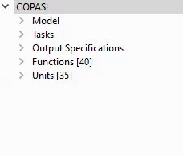
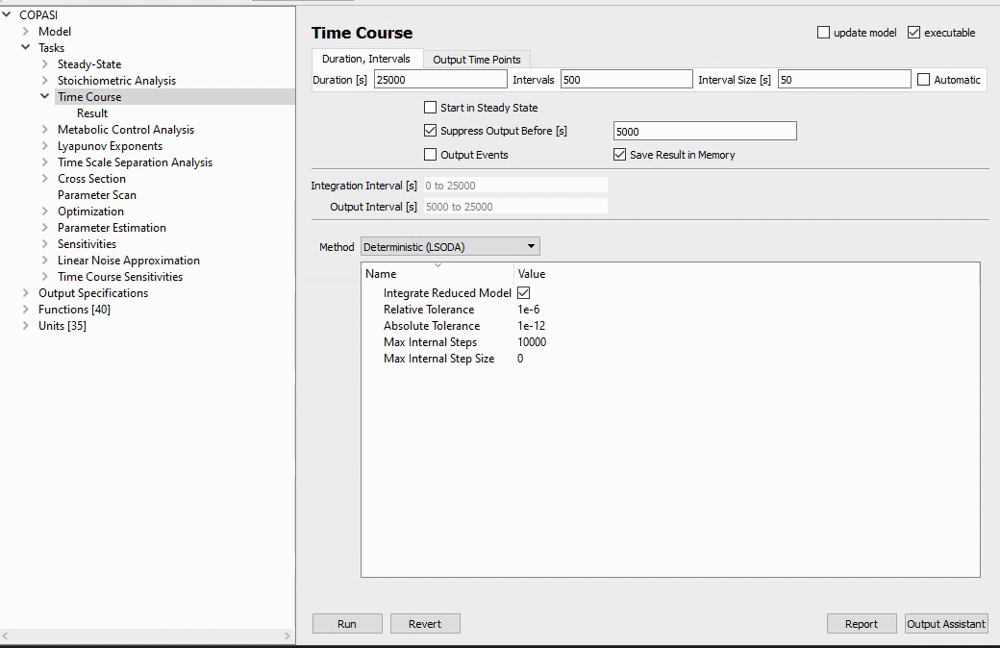

**objectives**

- Explain how the navigate the COPASI Task Tree and use the Time Course task.
- Explain when and how to add plots to a time course task.

**questions**

- How do I perform a time course simulation in COPASI.

---

This tutorial shows how to run a time course simulation in COPASI. We begin by loading a model of NF-kappa-B dynamics. You can either download file below, or open it directly in COPASI: 

<a class="btn btn-default" href="./NF-kappaB-no-plots.cps" role="button"> Download &raquo;</a> <a title="Starts COPASI and loads the file" class="btn btn-default" href="copasi://?downloadUrl={{site.url}}/Support/Tutorials/Time_Course_Simulation/NF-kappaB-no-plots.cps" role="button" > Run in COPASI &raquo;</a>

Once the file is loaded you see the model overview, and on the left side of the COPASI window the tree containing all model elements and tasks. 

|  | &nbsp; | Click the triangle to expand the Tasks tree, then click Time Course. You can also double click Tasks and then Time Course. | 

You can directly go ahead and run the task with the settings from the COPASI file by clicking the **Run** button. There is currently no plot defined in that model, but you can see the table containing the simulation results visible when clicking on **Result** in the tree>. You can click Save to create a tab-delimited text file from this.

To get a plot, the specifications for one need to be defined. The Output Assistant provides an easy way to do this. Click the **Output Assistant** button on the lower right of the COPASI window. Select the first predefined plot type. (You can change the title of the plot directly on the right). Now click Create:

 

This plot now appears in Plots, under Output Specifications where you can later edit it, modify it, or delete it. 

***NOTE:*** You only need to create the plot specification once, once it has been created (and is activated), it will automatically appear every time the task is run. The [Basic Plotting tutorial](#) covers customizing and creating plots without Output Assistant. 

Using the link below, the plot is automatically generated and the time course task is executed: 

<a title="Starts COPASI and loads the file" class="btn btn-default" href="copasi://?downloadUrl={{site.url}}/Support/Tutorials/Time_Course_Simulation/NF-kappaB-no-plots.cps&activate=Time-Course&createPlot=Concentrations%2C%20Volumes%2C%20and%20Global%20Quantity%20Values&runTask=Time-Course" role="button" > Create Plot and Run &raquo;</a>

In the plot window you can click to toggle, which species are displayed, among other things. Let's close this plot window.

#### Settings

Now we'll look at some settings which will affect the output to plots and tables.

Here at the Time Course window, we see the Duration setting. This is important in an oscillating model like this. With too short a duration, some oscillations will not be apparent.

Note here that we are ignoring the first 5000 seconds. This will exclude some of the models settling in time. Obviously our duration should be set higher than this, if we want to see anything.

We can also set the interval size directly, and indirectly, by choosing the number of intervals. A larger interval will reduce the number of samplings for output, and speed up the run. But this will come with the cost of plot smoothness, or even missing important transient features like oscillations. It's important to note that interval size only affects the output values for plots and tables. This does not set the step size for the internal integration algorithm. COPASI automatically and dynamically optimizes step size based on the settings given for absolute and relative tolerance.

### More information

* [Description of the Time Course Task](/Support/User_Manual/Tasks/Time_Course_Simulation/)
* [Video Tutorial Time Course Simulation](https://www.youtube.com/watch?v=BWUoRuYLJPQ&t=2s)