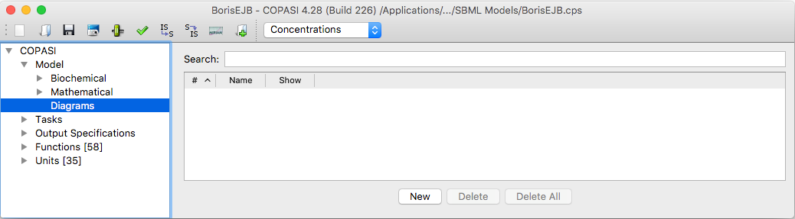
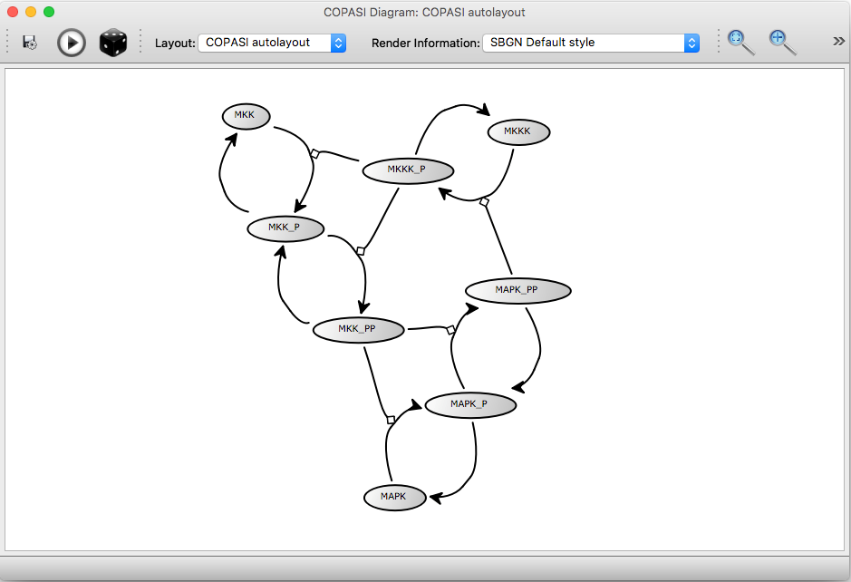
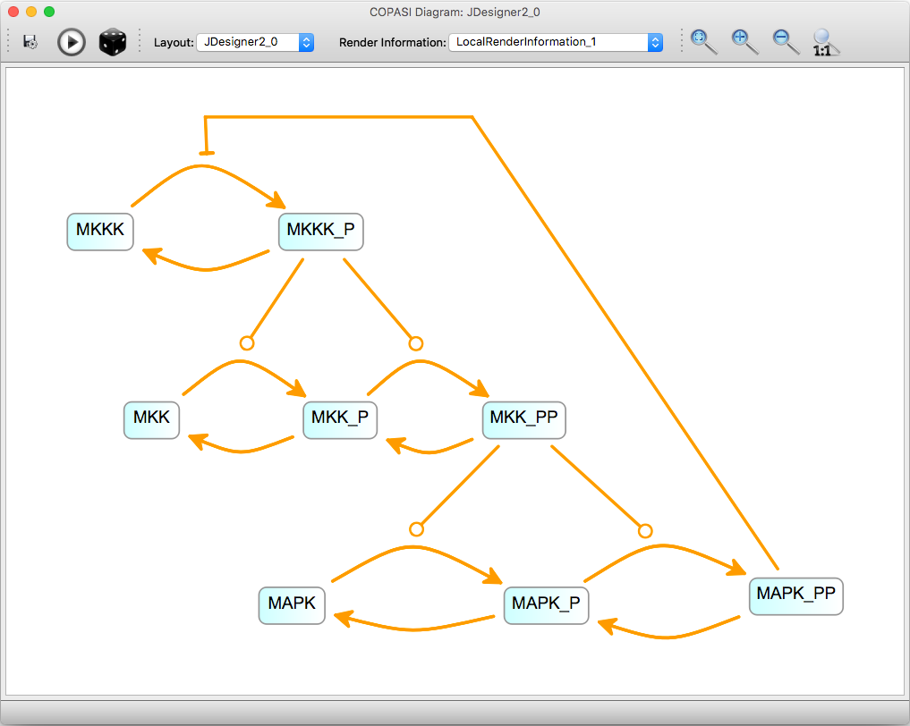
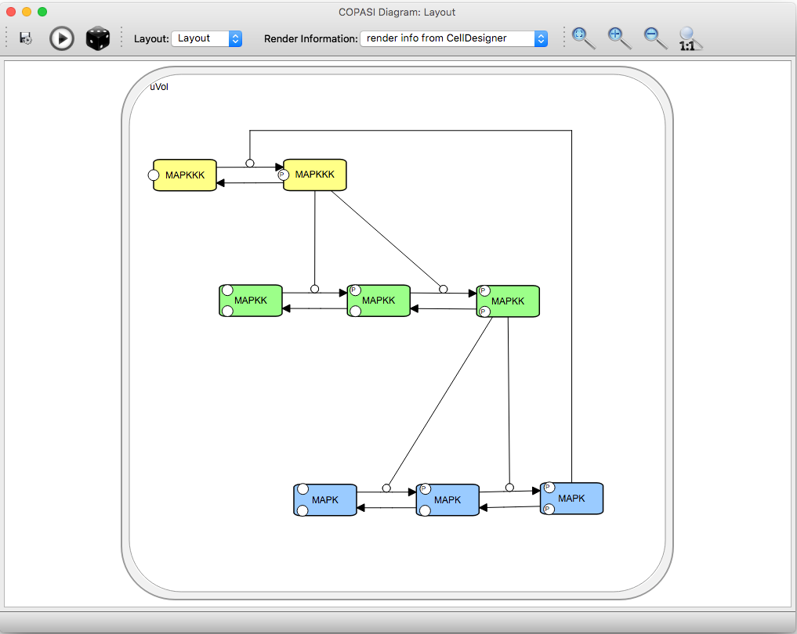
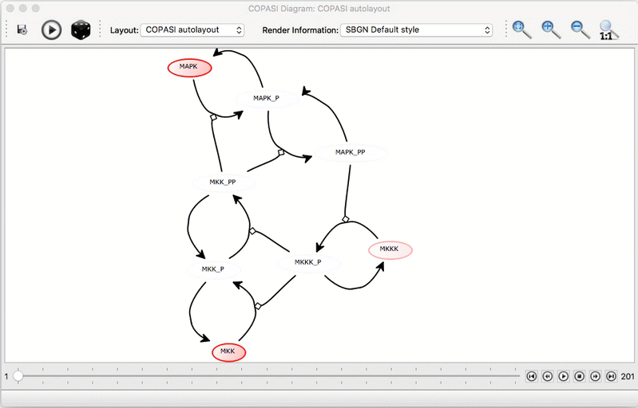
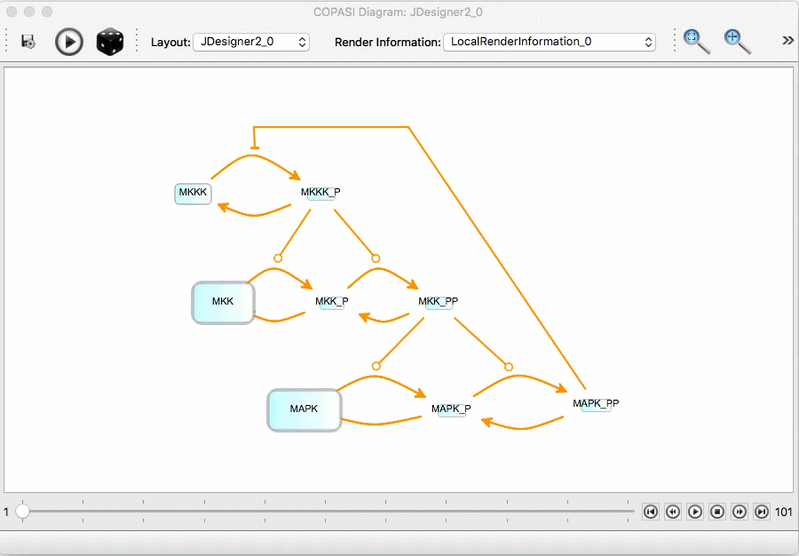

COPASI can read and display layout information from both COPASI and SBML files.
A key feature is the ability to animate diagrams using simulation time course
data. Layout information may be imported via the SBML Layout extension (see the
[SBML Layout Extension Specification](http://co.mbine.org/standards/sbml/level-3/version-1/layout)
for details) or obtained from a COPASI file that already contains a diagram
layout.

### Generating Layouts in COPASI

COPASI provides a force-directed layout algorithm to arrange network diagrams
automatically. To generate a new layout for your loaded model, select
**Model → Diagrams** from the tree, and click the **New** button in the list of
layouts.

  <table cellpadding="0" cellspacing="0">
    <tr>
      <td></td>
    </tr>
    <tr>
      <td class="mini">Empty list of Diagrams</td>
    </tr>
  </table>

When you click **New**, a wizard appears that lets you select which metabolites 
and reactions to include in your layout. If you check the **create compartment 
elements** option, a graphical representation of compartments will also be 
added. The next page of the wizard allows you to specify *side-compounds*: any 
metabolites you select here will be duplicated in the diagram for each reaction 
they participate in, helping to produce a cleaner, less cluttered layout.

After you complete the wizard, the automatic layout algorithm starts and you 
will see the drawing improve in real time. When the layout process finishes, 
you can manually reposition any elements as needed to achieve your preferred 
arrangement. Pressing the **Play** button on the toolbar restarts the layout 
algorithm from the current positions. If you'd like to adjust how the 
arrangement is computed, use **Layout Parameters** from the **View** menu. To 
shuffle all element positions randomly, click the **Dice** button.

  <table cellpadding="0" cellspacing="0">
    <tr>
      <td></td>
    </tr>
    <tr>
      <td class="mini">Generated Autolayout</td>
    </tr>
  </table>

The **Save** button allows you to export the current diagram as a PDF, SVG,
or PNG image. The **Layout** drop-down menu lets you switch between different
layouts stored in the file. For each layout, the **Render Information**
drop-down provides several alternative styles for displaying the diagram.

### Obtaining Layouts from Other Sources

There are several ways to obtain or create layout information for an SBML
model:

- **CellDesigner**: COPASI implements support for the graphical annotations
  used by [CellDesigner](http://celldesigner.org), making it possible to
  import diagrams created in CellDesigner.
- **newt**: The [Newt Pathway editor](https://web.newteditor.org/) can export diagrams
  as SBML with CellDesigner annotations, those can then be imported in COPASI.
- **SBML Layout Viewer**: The [SBML Layout Viewer](http://sysbioapps.spdns.org/Layout)
  is a web application that lets users add layout information to an SBML file, 
  with options to adjust parameters that influence the layout.
- **SBW**: A layout creation tool is also integrated in
  [SBW](http://sbw.sourceforge.net/). Since recent versions of COPASI
  support SBW, you can send a model from COPASI to the layout tool and
  receive a model back with layout information. Networks can also be created
  visually in JDesigner and then exported to SBML Layout format.
- **Antimony**: The latest version of [Antimony](https://antimony.sourceforge.net/) can also describe network diagrams.  

### Displaying the Diagrams

If your loaded model file contains layout information, the diagram table
will show one entry for each available layout. To display a specific
layout, either click the **Show** button next to the layout entry or
double-click on the entry in the table.

  <table cellpadding="0" cellspacing="0">
    <tr>
      <td></td>
      <td></td>
    </tr>
    <tr>
      <td class="mini">Layout from SBML Layout / Render Extension, as exported by JDesigner and SBW</td>
      <td class="mini">Imported layout from CellDesigner Annotations</td>
    </tr>
  </table>

### Displaying Task Results on the Layout

You can visualize the results of **Time Course Simulations**, **Elementary 
Modes**, and **Mass Conservation Analysis** directly on the network diagram. 
Before these results are available for display, you must first run the 
corresponding analysis task. For time courses, ensure that the option to keep 
results in memory is enabled.

If there is no available time course data, a warning will appear in the status 
bar of the layout window.

To load data after running a task, select the relevant option from the file menu 
within the layout window. On systems with a unified toolbar, you may first need 
to activate the layout window to ensure you are using its file menu, rather than 
COPASI's main file menu. Once data is loaded, video player-style controls will 
appear at the bottom of the layout window. Click the play button to start the 
animation.

  <table cellpadding="0" cellspacing="0">
    <tr>
      <td></td>
    </tr>
    <tr>
      <td class="mini">Time series result on top of an autogenerated layout, color mode</td>
    </tr>
  </table>

You can zoom and pan within the network diagram and reposition elements as 
needed. In the preferences menu, you can set how each individual element 
should be animated. The available animation modes are:

- **Scale mode**: The selected element is scaled in size from its initial to 
  final value.
- **Color mode**: The selected element's color changes smoothly (interpolates) 
  between the start and end colors within the specified range.
- **Shadow mode**: A shadow is applied to the selected element with the 
  chosen color, and the strength of the shadow varies according to the 
  specified range.

For all animation modes, scaling can be set to either **Global** or 
**Individual**:

- In **Individual Scaling** mode, each species’ size (or color) is 
  determined based only on its own minimum and maximum values.
- In **Global Scaling** mode, all species are scaled or colored according to 
  the minimum and maximum values across all species in the model.

  <table cellpadding="0" cellspacing="0">
    <tr>
      <td></td>
    </tr>
    <tr>
      <td class="mini">Time series result on top of an imported layout, scale mode</td>
    </tr>
  </table>

We plan to improve visualization features in the future. If you have suggestions or
feedback, please let us know—preferably through the [User Support Forum]({{ site.baseurl }}/Support/User_Forum/).
If you discover a bug, please report it using our [Issue Tracker](http://tracker.copasi.org).
