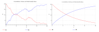

COPASI provides a single method for the explicit simulation of stochastic 
differential equations (SDEs): the stochastic Runge–Kutta (RI5) integrator. 
Unlike stochastic simulation algorithms such as Gillespie or τ-leaping, the 
RI5 integrator directly solves differential equations that include an explicit 
noise term.

Noise can be added at the reaction level in COPASI by defining a Noise 
Expression for individual reactions. To do this, navigate to 
**COPASI → Biochemical → Reactions**, select the reaction of interest, and 
click the "Add Noise" button next to the rate law. This enables you to specify 
a noise term to be included in the reaction rate. By default, COPASI sets the 
noise term proportional to the square root of the absolute particle flux for 
the reaction.

**Example:**  
To illustrate, start by creating a new model. First, change the **Quantity 
Unit** to `1` (dimensionless) instead of the default `mol` 
(**COPASI → Model → Quantity Unit**). Then go to **COPASI → Model → 
Biochemical → Reactions** and define a simple reaction: `A -> B`. Leave all 
other settings at their defaults, but use the "Add Noise" button (to the right 
of the rate law selector) to include a noise term. Next, set the initial 
concentration of A to `20 [1/l]` (**COPASI → Model → Biochemical → 
Species**).

Changing the Quantity Unit from `mol` to `1` makes the model quantities 
dimensionless. Alternatively, you could switch the mode in COPASI from 
"Concentration" to "Particle Numbers" using the dropdown menu at the top.

To simulate models with noise, make sure to select the **SDE Solver (RI5)** in 
the Time Course task. You can further adjust several RI5 integrator 
parameters:

- **Internal Step Size:**  The step size used by the integrator for internal 
  steps.
- **Max Internal Steps:**  Maximum number of internal steps allowed between 
  two output time points (positive integer; default is 10,000).
- **Force Physical Correctness:** Boolean option that, if enabled, prevents 
  negative particle numbers by reducing the step size as needed.
- **Absolute Tolerance:** Positive numeric value for the absolute error 
  tolerance. Smaller values increase numerical precision at the cost of higher 
  computation.
- **Tolerance for Root Finder:** Positive numeric value for the tolerance 
  used when locating event triggers. COPASI uses interpolation and Brent’s 
  method for root finding, which requires this value.

With the [example model](./RI5-example.cps) and default settings, after running the simulation, you 
will observe a time course influenced by stochastic noise.

  <table cellpadding="0" cellspacing="0">
    <tr>
      <td></td>
    </tr>
    <tr>
      <td class="mini">Simulation with SDE (left) and deterministic (right)</td>
    </tr>
  </table>

