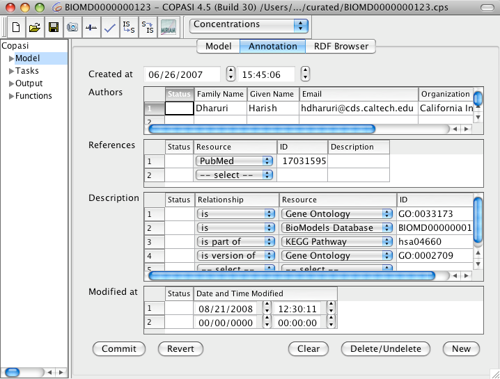

Including additional information in a model, such as details about model 
creation or biological information on individual model elements, is highly 
beneficial. This metadata becomes particularly important if you obtain a model 
from someone else or download it from an author’s website or a public model 
repository.

To standardize model annotation, the [MIRIAM (Minimal Information Requested in 
the Annotation of biochemical Models)](https://co.mbine.org/author/miriam/) 
guidelines have been developed. These guidelines outline what information is 
needed to ensure a model is well-annotated and suitable for publication.

COPASI allow users to annotate models and all model elements following the MIRIAM 
guidelines. In COPASI’s interface, the model widget—as well as the widgets for 
compartments, species, reactions, and global quantities—each provide two additional 
tabs at the top: **Annotation** and **RDF Browser**.

  <table cellpadding="0" cellspacing="0">
    <tr>
      <td></td>
    </tr>
    <tr>
      <td class="mini">
        Annotation&nbsp;Widget&nbsp;with&nbsp;Annotation&nbsp;from&nbsp;Model&nbsp;123&nbsp;from&nbsp;biomodels.net&nbsp;Database
      </td>
    </tr>
  </table>

The **Annotation** tab presents the same metadata in a more user-friendly way.
Different types of information can be provided for each model element. For
example, you may want to record who created or added a particular element, or
supply biological information describing a species’ identity.

Each annotation record is stored as a triplet: a *relationship*, a *resource*,
and an *identifier*. The *relationship* is selected from a predefined list, as
is the *resource*. For instance, to indicate that species A in your model is
ATP, you might set the relationship to *is* and select the [ChEBI (Chemical
Entities of Biological Interest)](http://www.ebi.ac.uk/chebi/) database as the
resource. The identifier would then be the ChEBI ID for ATP: 
[CHEBI:A15422](http://www.ebi.ac.uk/chebi/searchId.do?chebiId=CHEBI%3A15422).

In COPASI you specify this, in the `Description` field, by selecting the relationship
from the dropdown, then the resource (again from the dropdown), and finally specify 
the identifier. Should the resource dropdown be empty, you will have to update the
[MIRIAM database](#updating-the-miriam-database).

For additional technical details on how annotations are stored in COPASI, see
the [COPASI MIRIAM Annotation documentation]({{ site.baseurl
}}/Support/Technical_Documentation/MIRIAM_Annotation/).

COPASI (and SBML) use RDF (Resource Description Framework) to store annotation
information in the model file. You can view the resulting RDF structure by
selecting the **RDF Browser** tab. Note that this view is read-only and cannot
be used to edit annotations.

### Updating the MIRIAM Database

While COPASI installations come with an up-to-date list of MIRIAM resources, these
may change over time and so it can be updated using the "Update MIRIAM" button 
in the toolbar. This action downloads the MIRIAM resource file from the internet, 
so you must have an active internet connection. 
