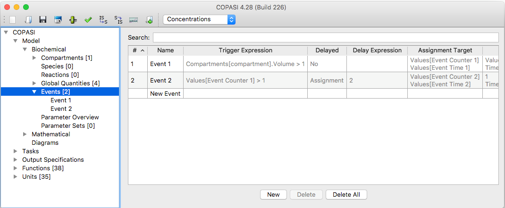
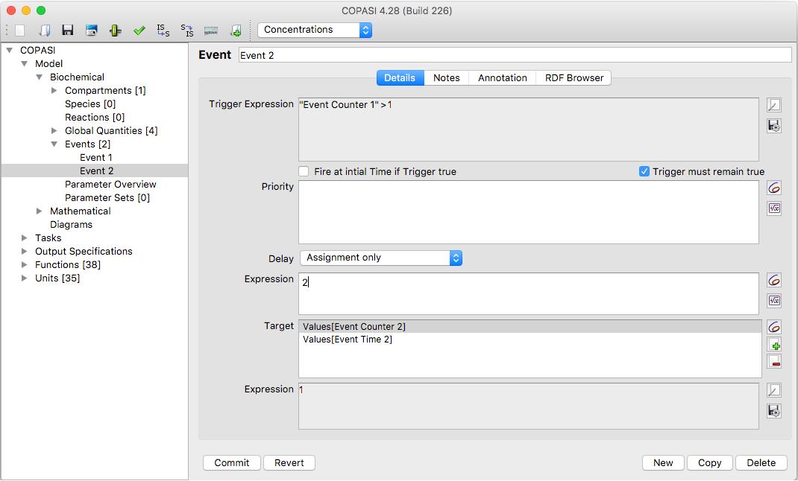

An **event** in COPASI represents a discrete, conditional state transition in
your model. Each event must have two components: a **trigger**, which causes
the event to occur, and at least one **assignment**, which modifies the model.
If an event contains multiple assignments, they are executed simultaneously
(regardless of the order in which they are listed). Additionally, an event can
include an **optional delay**, specifying how long COPASI will wait after
detecting the event trigger before carrying out the assignments.

### Trigger

An event trigger is a Boolean expression. The event is fired at the exact
moment when the value of the expression changes from `FALSE` to `TRUE`. Note
that the Boolean trigger expression cannot contain any of COPASI’s random
functions (`uniform()`, `gamma()`, `poisson()`, or `normal()`). By default,
the trigger only activates during a `FALSE` to `TRUE` transition. To allow the
trigger to fire at the initial simulation time if the expression is already
`TRUE`, enable the **Fire at initial Time if Trigger is true** option.

### Priority

If multiple events trigger at the same time, you can use a **priority
expression** to specify which event should execute first.

### Assignment

An event **assignment** consists of two elements: an expression and a target.
All assignments defined for a single event are applied together as a unit.
This means COPASI will update all relevant model components at once, and only
then check for further events. To perform an assignment, COPASI evaluates your
expression and assigns the resulting value to your specified target.

### Delay

An event delay is optional and defines the amount of simulation time between
firing the event and executing its assignments. There are two ways to apply a
delay:

1. **Delay Calculation and Assignment**: The delay occurs between the trigger
   and calculation of the target expression.
2. **Delay Assignment Only**: The delay occurs between calculating the
   expression and assigning the value to the target object.

If you use a delay, you have the option **Trigger must remain true**. If this
is enabled, COPASI will only execute the event if the trigger expression remains
true for the entire duration of the delay.

---

In the model tree, the **Events** branch is found directly below **Global
Quantities**. Selecting the Events branch opens a table listing all events in
your model. For a new model, this table will be empty. You can use the search
field to filter the displayed events: only events matching your filter in any
column will be shown, making it easy to find events by name or target.

    <table cellpadding="0" cellspacing="0">
    <tr>
    <td></td>
    </tr>
    <tr>
    <td class="mini">Event&nbsp;Table&nbsp;with&nbsp;2&nbsp;Entries</td>
    </tr>
    </table>

If you click on the name of an event in the tree on the left or double click on a row of the table the detailed
information correlated with the chosen event will be displayed.

    <table cellpadding="0" cellspacing="0">
    <tr>
    <td></td>
    </tr>
    <tr>
    <td class="mini">Detailed&nbsp;Event&nbsp;with&nbsp;2&nbsp;Assignments&nbsp;and&nbsp;Delay</td>
    </tr>
    </table>

On the event detail screen, you can specify the Boolean trigger expression, an
optional delay, and multiple event targets. When adding an event target, COPASI
will only allow you to select values that are not already determined by
assignments, as modifying such values would create conflicts.

For each mathematical expression associated with an event—including the trigger,
delay, and assignment expressions—you can use the same elements available for
defining user functions. For a detailed description of these elements, see
the [User Defined Functions]({{ site.baseurl }}/Support/User_Manual/Model_Creation/User_Defined_Functions/)
section.

You can also reference values from other model entities in your mathematical
expressions. These can be conveniently selected by pressing the button with the
COPASI icon.
