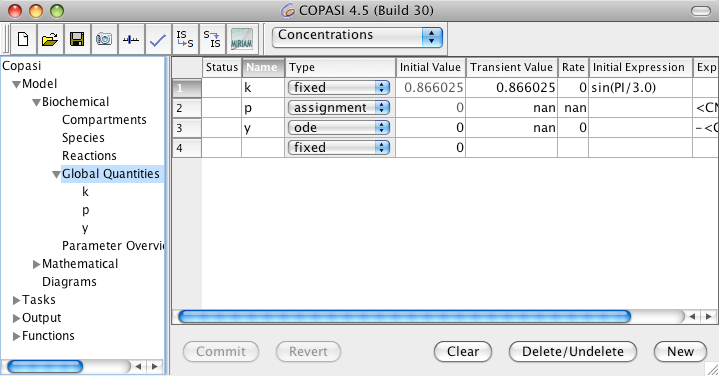
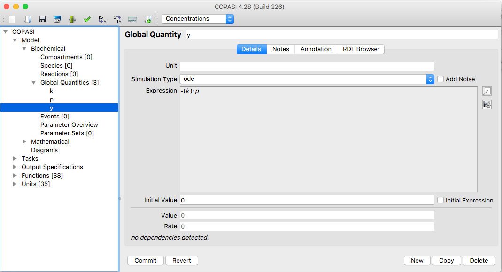
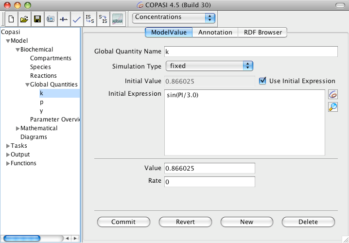

A global quantity (sometimes called a global parameter) can represent nearly
anything in your model. Most commonly, a global quantity is used as a shared
parameter for several reactions, but you can use it to represent any variable or
process that is not specifically located within a compartment.

In the model tree, you will find the **Global Quantities** branch just below the
Reactions branch. Selecting this branch opens a table displaying all global
quantities currently defined in your model. When you create a new model, this
table—like the others—begins empty (see image below).

The table contains eight columns: *Index* and *Name* 
should be familiar from previous sections. The third column shows the 
type of each global quantity, which can be one of three options:

- **fixed**: the global quantity has a constant value (usable as a 
  global parameter)
- **assignment**: the value of the quantity is calculated from a 
  mathematical expression
- **ode**: the quantity is treated as a model variable, and its 
  value is defined by a differential equation

The fourth column shows the unit, while the fifth and six columns show 
the initial and transient values of the global quantity. the seventh column displays 
the rate of change. The final two columns present the mathematical expressions, 
when required, for types other than *fixed*.

As with other model elements, you can add a global 
quantity in several ways. The simplest method is to enter a name 
directly into an empty cell in the *Name* column.

    <table cellpadding="0" cellspacing="0">
    <tr>
    <td></td>
    </tr>
    <tr>
    <td class="mini">Global&nbsp;Quantities&nbsp;Table&nbsp;with&nbsp;3&nbsp;Entries</td>
    </tr>
    </table>

If you click on the name of a global quantity in the tree on the left or double click on a row of the table only the
information correlated with the chosen global quantity will be displayed.

    <table cellpadding="0" cellspacing="0">
    <tr>
    <td></td>
    </tr>
    <tr>
    <td class="mini">Global&nbsp;Quantity&nbsp;User&nbsp;Interface&nbsp;with&nbsp;ODE&nbsp;Rrule</td>
    </tr>
    </table>

Just as compartments and species, global quantities do not have to be a constant but can be reassigned during e.g. a
time course simulation depending the values of one or more model entities. In order to specify whether a parameter
has a constant value or the value is calculated on the fly according to a mathematical expression, the drop down
list called Simulation Type should be used.

The drop down list contains three following entries:

<table class="table table-striped table-hover" style="caption-side: top;">
    <caption>Global Quantities Simulation Types</caption>
    <colgroup>
    <col width="10%" />
    <col width="90%" />
    </colgroup>
    <thead>
    <tr>
    <th> Name </td>
    <th> Description </td>
    </tr>  
    </thead>
    <tbody>
    <tr>
    <td>fixed </td>
    <td> the value of the parameter is constant (which corresponds to the given initial value)</td>
    </tr>
    <tr>
    <td>assignment </td>
    <td> the value of the parameter is determined by evaluating the given mathematical expression</td>
    </tr>
    <tr>
    <td>ode </td>
    <td> the rate of change of the parameters value is determined by an ordinary differential equation
    </td>
    </tr>
    </tbody>
</table>

To have a parameter's value determined by a mathematical expression, choose
**assignment** from the Simulation Type drop-down menu. This enables a text
field where you can enter the mathematical expression used to calculate the
parameter's value. Similarly, if you want the rate of change of the parameter to
be defined by an ordinary differential equation (ODE), select **ode** from the
drop-down menu.

You can specify not only a parameter's value over time, but also its initial
value, using a mathematical expression. To do this, check the box labeled **Use
Initial Expression**. Note that an initial expression can only be defined if the
Simulation Type is set to either **fixed** or **ode**. If the Simulation Type is
**assignment**, the assignment itself automatically provides the initial value,
and no separate initial expression is needed.

    <table cellpadding="0" cellspacing="0">
    <tr>
    <td></td>
    </tr>
    <tr>
    <td class="mini">Global&nbsp;Quantity&nbsp;Widget&nbsp;with&nbsp;an&nbsp;Initial&nbsp;Assignment</td>
    </tr>
    </table>

    

The mathematical expressions used for rules and initial assignments can include
the same elements available when defining user-defined functions. For a detailed
description of these elements, see the
[User Defined Functions]({{ site.baseurl }}/Support/User_Manual/Model_Creation/User_Defined_Functions/)
section.

When creating mathematical expressions, there is a subtle difference between
those used for rules and those used for initial assignments. A rule expression
may reference the current (transient) values of other model entities, whereas
an initial assignment may reference only the initial values of those entities.

Although COPASI is not designed to build models directly from systems of
ordinary differential equations (ODEs), you can represent a system of ODEs
within COPASI by defining a set of global parameters of type `ode`.