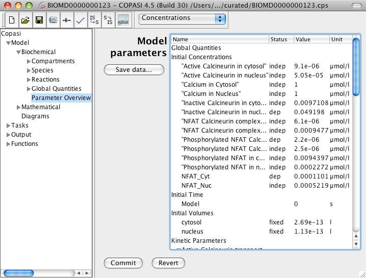

The **Parameter View** provides a centralized interface where you can view and 
edit all model parameters in one place. To access it, select the *Parameter 
Overview* leaf under the **Model → Biochemical** branch (see below). 

This view is especially useful for making edits efficiently, as it eliminates 
the need to navigate throughout the model tree whenever you need to update 
several parameters. At the top, you will see the initial concentrations for all 
species, followed by the initial simulation time and the volumes of all 
compartments. At the bottom, the kinetic parameters for all reactions are 
displayed.

To edit any value, double-click on the cell you wish to change, enter your new 
value, and press the return key or click elsewhere. Your edits will not be 
applied to the model immediately; instead, a `*` will appear next to the name 
of a changed parameter, indicating that it has been modified but not yet 
committed. To finalize your changes, either press the **Commit** button at the 
bottom of the dialog or leave the widget. The updates will then be applied to 
the relevant objects in your model.

  <table cellpadding="0" cellspacing="0">
    <tr>
      <td></td>
    </tr>
    <tr>
      <td class="mini">Parameter&nbsp;View</td>
    </tr>
  </table>

You can export the current parameter settings by clicking **Save to File**. 
Parameters can be saved in tabular formats such as TSV or CSV, as plain text, or 
in INI format. The INI format can be used later for command-line operations (see 
the [command line reference](
{{ site.baseurl }}/Support/User_Manual/Model_Creation/Commandline_Version_and_Commandline_Options/)).

Alternatively, you can store the current parameter configuration as a parameter 
set for easy reuse. To do this, select **Store as Parameter Set**.

# Parameter Sets

COPASI also contains a list of Parameter Sets, that have been either created, using the **Store 
as Parameter Set** option from the Parameter Overview, or have been created by Optimizations or 
Parameter Estimation runs, with the `Create Parameter Sets` option enabled. 

In the Parameter Sets overview, you can create new Parameter Sets, or delete existing ones. In the 
detail view you can `Apply` them, that is to overwrite the current models state with the stored one 
(COPASI will give you the option of saving the current state before). It will also highlight 
differences of the current model state from the one stored in the parameter set.