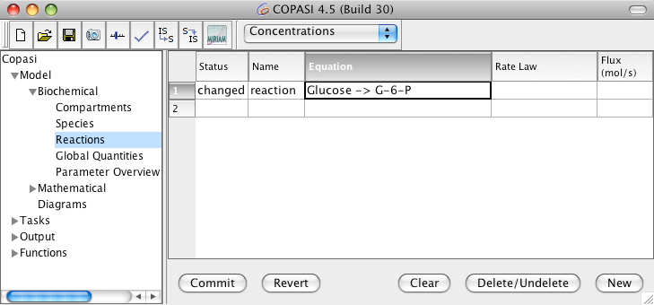
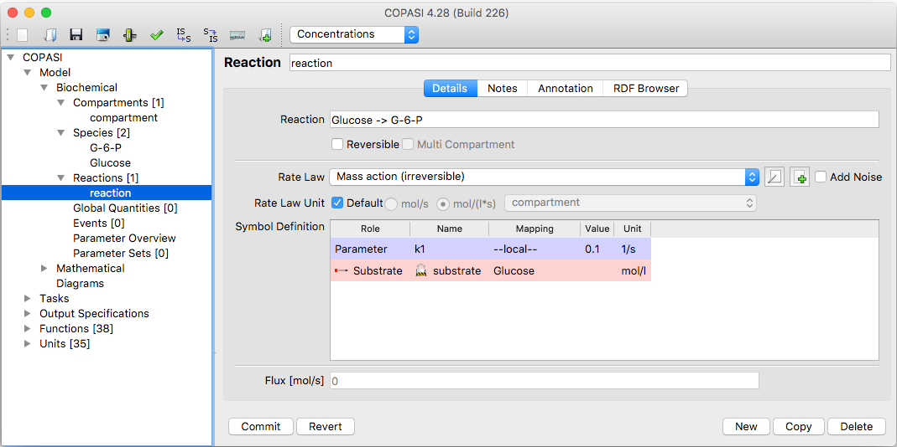

A reaction in COPASI represents a chemical reaction in the model. It consists of substrates, products and optionally
modifiers. The substrates are **consumed** by the reaction, the products are **produced** by the reaction and modifiers influence 
the reaction but are neither **consumed** nor **produced** by it. A reaction has a kinetic rate law which defines how fast
the reaction proceeds. 

Adding reactions in COPASI works much like adding compartments or species. To
add reactions, navigate to the **Reactions** branch in the object tree, which
is found under **Model → Biochemical**. This opens a table with six columns:

- **Index**: The index of the reaction.
- **Name**: The name of the reaction.
- **Equation**: The chemical equation, including any modifiers.
- **Kinetics**: The type of kinetic rate law used by the reaction (dependent on
  the equation).
- **Flux**: The flux through the reaction (this value is calculated by COPASI
  and cannot be set manually).
- **Noise Expression**: if the reaction is a SDE, the noise expression of the 
  reaction will be displayed here. 

The the flux is computed automatically when you
[run a time course simulation](
{{ site.baseurl }}/Support/User_Manual/Tasks/Time_Course_Simulation/).

The simplest way to add a reaction is to enter the chemical equation directly
into an empty "Equation" cell in the table. Pressing the return key after
typing the equation moves the cursor to the next row, allowing you to quickly
add multiple reactions. When you are done entering equations, you "commit" all
the reactions at once.

If any of the reaction equations include species that do not yet exist in the
model, COPASI will add these species automatically. If there is no compartment
yet, COPASI will create one and add all new species to it. If compartments
already exist, new species will be added to the first compartment listed in the
object tree.

Warning: When typing reaction equations you should keep
  in mind that species names in COPASI can contain characters like &quot;+&quot; or even white-spaces. Since these
  characters would make it very hard if not impossible to parse the chemical reaction equation, you have to place
  those species names in double quotes. E.g. &quot;Species 1&quot; + &quot;Species 2&quot; -&gt; &quot;Species
  3&quot;. No matter if your species names contain special characters or not, the species names have to be separated
  from the reaction symbols (+, *, =, and -&gt; ) by white-spaces.
 
 

  <table cellpadding="0" cellspacing="0">
    <tr>
      <td></td>
    </tr>
    <tr>
      <td class="mini">Reaction&nbsp;Table&nbsp;with&nbsp;new&nbsp;Entry</td>
    </tr>
  </table>

Each new reaction gets a default kinetic rate law which is irreversible mass action for reactions that contain a
substrate. For reaction that only have a product (e.g. influx into a system) a constant flux kinetic is
chosen (or `Mass action (reversible)` in case of a reversible reaction).

  <table cellpadding="0" cellspacing="0">
    <tr>
      <td></td>
    </tr>
    <tr>
      <td class="mini">Dialog&nbsp;for&nbsp;changing&nbsp;Reaction&nbsp;Parameters</td>
    </tr>
  </table>

<

Double-clicking on a reaction entry in the table opens a dialog where you can 
edit various parameters for the reaction. Here, you can change the reaction's 
name, its chemical equation, and whether or not the reaction is reversible. 
Altering either the chemical equation or the reversibility affects the list of 
kinetic rate laws available to be assigned to the reaction. Each kinetic rate 
law specifies the number of substrates, products, and modifiers it requires, and 
whether it is suitable only for reversible or irreversible reactions, or both. 
As a result, only the compatible kinetic functions are shown in the Rate Law 
dropdown based on your current equation setup. If the kinetic function you want 
does not exist yet, you can add it with the "New Rate Law" button (see also 
[User Defined Functions]({{ site.baseurl }}/Support/User_Manual/Model_Creation/User_Defined_Functions/)). 
Selecting a kinetic function displays its parameters in the "Symbol Definition" 
table—each of these parameters is initialized to a default value of 0.1, which 
you can change by clicking on the cell and entering a new value.

By default, all kinetic function parameters are local; they only apply to the 
rate law in the selected reaction. In some cases, it may be beneficial to use 
the same parameter across several reactions. This approach allows you to change 
the parameter value in a single place, instead of updating it individually in 
each reaction. Parameters that can be used in multiple reactions are called 
*global quantities* in COPASI. For details on creating global quantities, see 
the [Global Quantities]({{ site.baseurl }}/Support/User_Manual/Model_Creation/Global_Quantities/) 
section. Suppose you have already defined a global quantity; to use it in a 
rate law, check the "global" box for the parameter in the Symbol Definition 
table. COPASI will then let you choose from any global quantities defined in the 
model. If no global quantities exist, the dropdown will only contain 
"unknown"—you will first need to define a global quantity and then return to 
this reaction. If "unknown" is selected, and you leave the dialog, COPASI will 
automatically revert the parameter to "local."

### Chemical equations
Chemical equations in COPASI follow a simple schema. First, list all substrates, 
separated by a "+" (plus) character, with at least one space before and after 
each "+". If you do not include spaces, COPASI will interpret the "+" as part of 
the species name (which is allowed). After specifying the substrates, indicate 
whether the reaction is reversible or irreversible by typing either an equals 
sign ("=") for reversible, or the character sequence "->" for irreversible. 
After this, list the products, again separated by " + " with spaces. Optionally, 
you may add a semicolon (;) followed by one or more modifiers, separated by 
spaces. You may omit either the substrate list or the product list, but at 
least one must be present.

For example:  
1. *Species A is irreversibly converted to Species B:*  
   Chemical equation: `A -> B`  
2. *Species A and B are reversibly converted to Species C, with modifiers C and 
   D (note that one modifier also appears as a product):*  
   Chemical equation: `A + B = C; C D`

Warning: If the reaction takes place in one compartment,
  the reaction kinetic specifies a rate of concentration change, whereas if the reaction takes place in several
  compartments, the kinetic specifies the amount of substance change over time. 
   
  E.g. in the reaction A -&gt; B, if A and B are in the same compartment, the kinetic function for the reaction
  returns its result in mol/(l*s). If A and B reside in different compartments, the result is returned in mol/s.
  (This assumes that your default units are set to mol, l and s.)

  
