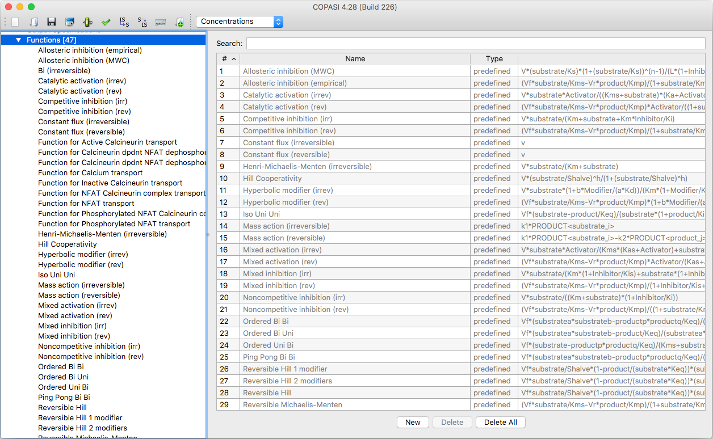
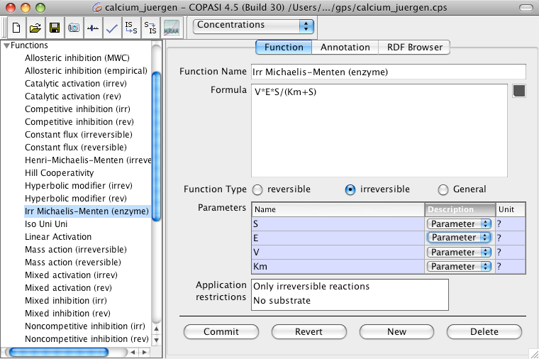
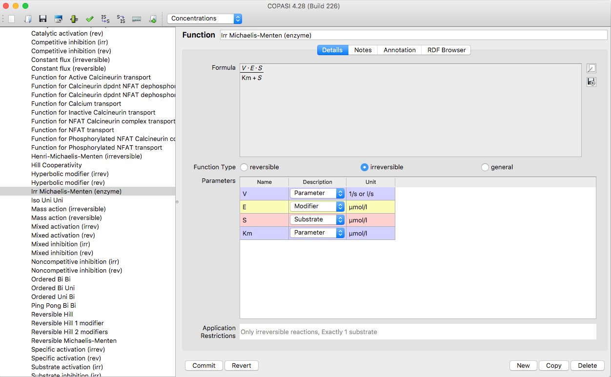

COPASI provides a comprehensive library of commonly used kinetic functions 
that you can choose from when building your model. You can view the complete 
list of these predefined functions by navigating to the `Functions` branch 
of the object tree in the COPASI interface.

<div class="img" align="center">
  <table cellpadding="0" cellspacing="0">
    <tr>
      <td></td>
    </tr>
    <tr>
      <td class="mini">Function&nbsp;Table&nbsp;with&nbsp;predefined&nbsp;Functions</td>
    </tr>
  </table>
</div>


Sometimes you may need to define a custom kinetic function to address a 
specific modeling requirement. COPASI allows you to create your own functions 
by either double-clicking an empty row in the functions table or clicking the 
**New** button at the bottom of the screen. In the function definition dialog, 
enter a unique name for your new function in the **Function Name** field. Then, 
specify the formula that describes the reaction rate in the **Formula** field. 

The allowable syntax allowed for functions is specified in the [Available Operators and Functions section below](#available-operators-and-functions).

**Note** that this formula should only represent the right-hand side of the rate 
equation.


<div class="img" align="center">
  <table cellpadding="0" cellspacing="0">
    <tr>
      <td></td>
    </tr>
    <tr>
      <td class="mini">Function&nbsp;Definition&nbsp;Dialog</td>
    </tr>
  </table>
</div>

For example, if you want to define the Michaelis-Menten equation, which can be
written as `v = V * (S / (Km + S))`, you would enter only the right-hand side
(`V * (S / (Km + S))`) into the Formula field. As you type, COPASI immediately
attempts to interpret the formula and automatically identifies any parameters
used. These parameters are then listed in the Parameters table below the formula
entry area.


<div class="img" align="center">
  <table cellpadding="0" cellspacing="0">
    <tr>
      <td></td>
    </tr>
    <tr>
      <td class="mini">
        Function&nbsp;Definition&nbsp;Dialog&nbsp;with&nbsp;graphical&nbsp;Display&nbsp;of&nbsp;the&nbsp;Function
      </td>
    </tr>
  </table>
</div><br />


In COPASI, parameter names can be chosen freely, but there are a few important
rules to keep in mind:
- If a parameter name starts with a letter or underscore, and contains only
  letters, digits, or underscores, no special formatting is needed.
- If the name contains any other characters, you must enclose the entire name
  in double quotes.
- If the name itself includes double quotes or backslashes, these characters
  need to be escaped with a backslash (e.g., `\"` or `\\`).

By default, any variable identified in your function formula will be assigned
the type *Parameter*. However, you should specify the correct type for each
variable by selecting from the "Description" dropdown list. Valid options are: 

* **Substrate**: for substrates of a reaction,
* **Product**: for products of a reaction,
* **Modifier**: a species that is neither produced or consumed
* **Parameter**: a local or global parameters
* **Volumne**: a compartment 
* **Time**: the model time symbol


The types you assign to variables will affect where the function can be used.
For example, if you define a function using two substrates and a modifier,
that function can only be applied to reactions which actually have two
substrates and a modifier.


<div class="alert alert-warning" role="alert"><span class="glyphicon glyphicon-exclamation-sign"
    aria-hidden="true"></span><span class="sr-only">Warning:</span> The restrictions on the number of modifiers is
  not strict since substrates and reactants could act as modifiers. So the above mentioned rate law could be used on
  reactions that do not explicitly specify a modifier.
</div>


You can also see how restrictions apply in the "Application Restrictions" table, 
which appears below the Parameters table in the function dialog. For example, 
if you define a function as `A*B` and set **A** and **B** to be substrates, the 
Application Restrictions table will indicate that this function is applicable 
only to reactions with exactly two substrates. After defining such a function, 
it can be used for any chemical reaction containing exactly two substrates.

Before committing your function, you must also specify whether it is valid for 
reversible reactions, irreversible reactions, or both. This is controlled using 
the **Reversible**, **Irreversible**, or **General** radio buttons.

You can also call other functions from within your user-defined function. 
Keep these four important rules in mind when calling a function from another 
function:

1. **No recursive calls:** A function must not call itself, directly or 
   indirectly (i.e., through calling another function which calls the first).
2. **Correct number of arguments:** Ensure that you provide the exact number 
   of arguments required by the function you're calling.
3. **Correct argument types:** Make sure that the types of arguments match 
   what is expected by the function. For example, if calling 
   `Henry-Michaelis-Menten (irreversible)`, the first argument must be a 
   *Substrate* and the other two must be *Parameters*.
4. **Quoting function names:** COPASI's built-in function names may include 
   spaces or special characters (such as hyphens). To call one of these 
   functions, put its name in double quotes. For instance, you would call it 
   like this:

   ```
   "Henry-Michaelis-Menten (irreversible)"(S, Km, V)
   ```

Once you have created and committed your user-defined function, it becomes 
available for use in reaction definitions just like any other kinetic rate law.


## Available Operators and Functions

The operators and functions that COPASI knows and therefore can be used to create user defined functions are the
following:<br />
<h3 name="Standard_Operators">Standard Operators</h3>
<table class="table table-striped table-hover" style="caption-side: top;">
  <caption>Standard Operators</caption>
  <thead>
    <tr>
      <th scope="col">Operator/Function</th>
      <th scope="col">Description</th>
    </tr>
  </thead>
  <colgroup>
    <col width="30%" />
    <col width="70%" />
  </colgroup>
  <tbody>
  <tr>
    <td>+</td>
    <td>plus operator</td>
  </tr>
  <tr>
    <td>-</td>
    <td>minus operator</td>
  </tr>
  <tr>
    <td>/</td>
    <td>division operator</td>
  </tr>
  <tr>
    <td>*</td>
    <td>multiplication operator</td>
  </tr>
  <tr>
    <td>%</td>
    <td>modulus operator</td>
  </tr>
  <tr>
    <td>^</td>
    <td>power operator</td>
  </tr>
</tbody>
</table><br />
<h3 name="Miscellaneaous_Functions">Miscellaneaous Functions</h3>
<table class="table table-striped table-hover" style="caption-side: top;">
  <caption>Miscellaneaous Functions</caption>
  <thead>
    <tr>
      <th scope="col">Operator/Function</th>
      <th scope="col">Description</th>
    </tr>
  </thead>
  <colgroup>
    <col width="30%" />
    <col width="70%" />
  </colgroup>
  <tbody>
  <tr>
    <td>abs / ABS</td>
    <td>absolute value</td>
  </tr>
  <tr>
    <td>floor / FLOOR</td>
    <td>floor value</td>
  </tr>
  <tr>
    <td>ceil / CEIL</td>
    <td>next highest integer</td>
  </tr>
  <tr>
    <td>factorial / FACTORIAL</td>
    <td>factorial function</td>
  </tr>
  <tr>
    <td>log / LOG</td>
    <td>natural logarithm</td>
  </tr>
  <tr>
    <td>log10 / LOG10</td>
    <td>logarithm for base 10</td>
  </tr>
  <tr>
    <td>exp / EXP</td>
    <td>exponent function</td>
  </tr>
</tbody>
</table><br />
<h3 name="Trigonometric_Functions">Trigonometric Functions</h3>
<table class="table table-striped table-hover" style="caption-side: top;">
  <caption>Trigonometric Functions</caption>
  <thead>
    <tr>
      <th scope="col">Operator/Function</th>
      <th scope="col">Description</th>
    </tr>
  </thead>
  <colgroup>
    <col width="30%" />
    <col width="70%" />
  </colgroup>
  <tbody>
  <tr>
    <td>sin / SIN</td>
    <td>sine function</td>
  </tr>
  <tr>
    <td>cos / COS</td>
    <td>cosine function</td>
  </tr>
  <tr>
    <td>tan / TAN</td>
    <td>tangent function</td>
  </tr>
  <tr>
    <td>sec / SEC</td>
    <td>secand function</td>
  </tr>
  <tr>
    <td>csc / CSC</td>
    <td>cosecand function</td>
  </tr>
  <tr>
    <td>cot / COT</td>
    <td>cotangent function</td>
  </tr>
  <tr>
    <td>sinh / SINH</td>
    <td>hyperbolic sine function</td>
  </tr>
  <tr>
    <td>cosh / COSH</td>
    <td>hyperbolic cosine function</td>
  </tr>
  <tr>
    <td>tanh / TANH</td>
    <td>hyperbolic tangent function</td>
  </tr>
  <tr>
    <td>sech / SECH</td>
    <td>hyperbolic secand function</td>
  </tr>
  <tr>
    <td>csch / CSCH</td>
    <td>hyperbolic cosecand function</td>
  </tr>
  <tr>
    <td>coth / COTH</td>
    <td>hyperbolic cotangent function</td>
  </tr>
  <tr>
    <td>asin / ASIN</td>
    <td>arcsine function</td>
  </tr>
  <tr>
    <td>acos / ACOS</td>
    <td>arccosine function</td>
  </tr>
  <tr>
    <td>atan / ATAN</td>
    <td>arctangent function</td>
  </tr>
  <tr>
    <td>arcsec / ARCSEC</td>
    <td>arcsecand function</td>
  </tr>
  <tr>
    <td>arccsc / ARCCSC</td>
    <td>arccosecand function</td>
  </tr>
  <tr>
    <td>arccot / ARCCOT</td>
    <td>arccotangent function</td>
  </tr>
  <tr>
    <td>arcsinh / ARCSINH</td>
    <td>hyperbolic arcsine function</td>
  </tr>
  <tr>
    <td>arccosh / ARCCOSH</td>
    <td>hyperbolic arccosine function</td>
  </tr>
  <tr>
    <td>arctanh / ARCTANH</td>
    <td>hyperbolic arctangent function</td>
  </tr>
  <tr>
    <td>arcsech / ARCSECH</td>
    <td>hyperbolic arcsecand function</td>
  </tr>
  <tr>
    <td>arccsch / ARCCSCH</td>
    <td>hyperbolic arccosecand function</td>
  </tr>
  <tr>
    <td>arccoth / ARCCOTH</td>
    <td>hyperbolic arccotangent function</td>
  </tr>
</tbody>
</table><br />
<h3 name="Random_Distribuitions">Random Distribuitions</h3>
<table class="table table-striped table-hover" style="caption-side: top;">
  <caption>Random Distributions</caption>
  <thead>
    <tr>
      <th scope="col">Operator/Function</th>
      <th scope="col">Description</th>
    </tr>
  </thead>
  <colgroup>
    <col width="30%" />
    <col width="70%" />
  </colgroup>
  <tbody>
  <tr>
    <td>uniform/UNIFORM </td>
    <td> This functions takes 2 arguments min and max. It returns a normally distributed value in the
      open interval (min, max).</td>
  </tr>
  <tr>
    <td>normal/NORMAL </td>
    <td> This function takes 2 arguments mean and standard deviation. It returns a uniform distributed
      value with the given mean and standard deviation.</td>
  </tr>
  <tr>
    <td>gamma/GAMMA </td>
    <td> This function takes 2 arguments shape and scale deviation. It returns a gamma distributed
      value with the given values.</td>
  </tr>
  <tr>
    <td>poisson/POISSON </td>
    <td> This function takes 1 argument mu. It returns a poisson distributed
      value with the given expected rate of occurrences.</td>
  </tr>
</tbody>
</table><br />
<h3 name="Logical_Operators">Logical Operators</h3>
The logical operators and comparisons are evaluated in the order they are listed in the table.<br />
<br />
<table class="table table-striped table-hover" style="caption-side: top;">
  <caption>Logical Operators</caption>
  <thead>
    <tr>
      <th scope="col">Operator/Function</th>
      <th scope="col">Description</th>
    </tr>
  </thead>
  <colgroup>
    <col width="30%" />
    <col width="70%" />
  </colgroup>
  <tbody>
  <tr>
    <td>le / LE / &lt;=</td>
    <td>smaller or equal (&le;)</td>
  </tr>
  <tr>
    <td>lt / LT / &lt;</td>
    <td>smaller (&lt;)</td>
  </tr>
  <tr>
    <td>ge / GE / &gt;=</td>
    <td>greater or equal (&ge;)</td>
  </tr>
  <tr>
    <td>gt / GT / &gt;</td>
    <td>greater (&gt;)</td>
  </tr>
  <tr>
    <td>ne / NE / !=</td>
    <td>not equal (!=)</td>
  </tr>
  <tr>
    <td>eq / EQ / ==</td>
    <td>equal (=)</td>
  </tr>
  <tr>
    <td>and / AND / &amp;&amp;</td>
    <td>logical and (&amp;)</td>
  </tr>
  <tr>
    <td>or / OR / ||</td>
    <td>logical or (|)</td>
  </tr>
  <tr>
    <td>xor / XOR</td>
    <td>logical xor</td>
  </tr>
  <tr>
    <td>not / NOT / !</td>
    <td>logical negation</td>
  </tr>
</tbody>
</table><br />
<h3 name="Conditional_Statement">Conditional Statement</h3>
In addition to defining &quot;normal&quot; functions, COPASI allows the definition of piecewise defined functions.
Piecewise defined functions are constructed with the IF statement.<br />
<br />
<table class="table table-striped table-hover" style="caption-side: top;">
  <caption>Conditional Statements</caption>
  <thead>
    <tr>
      <th scope="col">Operator/Function</th>
      <th scope="col">Description</th>
    </tr>
  </thead>
  <colgroup>
    <col width="30%" />
    <col width="70%" />
  </colgroup>
  <tbody>
  <tr>
    <td>if() / IF()</td>
    <td>if statement for the construction of piecewise defined functions etc.</td>
  </tr>
</tbody>
</table><br />
<br />
The functions name can be written with either all lowercase letters or all letters uppercase. Mixing of upper and
lowercase letters is not allowed and will lead to errors. This function takes 3 arguments separated by a
comma:<br />
<ol>
  <li> Boolean expression
  </li>
  <li> Expression evaluated if the first argument evaluates to <i>true</i>.
  </li>
  <li> Expression evaluated if the first argument evaluates to <i>false</i>.
  </li>
</ol>
So in order to make this a little more clear, we will look at how one would implement the Heaviside step function in
COPASI:<br />
<br />
<tt>
  <div align="center">if(x lt 0.0, 0.0, if(x gt 0.0, 1.0, 0.5))</div>
</tt><br />
<br />
<div class="alert alert-warning" role="alert"><span class="glyphicon glyphicon-exclamation-sign"
    aria-hidden="true"></span><span class="sr-only">Warning:</span> Although COPASI allows the usage of
  discontinuous functions (ceil, floor, factorial, etc) all integration is done by LSODA which officially can not
  handle discontinuous functions. Nevertheless in most cases this will lead to correct results, however you should
  be aware of the fact that the usage of discontinuous functions in COPASI can lead to errors. Later versions of
  COPASI will use different integration methods that will be able to deal with discontinuous functions.</div><br />
<br />
<h3 name="Parenthesis">Parenthesis</h3>
<table class="table table-striped table-hover" style="caption-side: top;">
  <caption>Parenthesis</caption>
  <thead>
    <tr>
      <th scope="col">Operator/Function</th>
      <th scope="col">Description</th>
    </tr>
  </thead>
  <colgroup>
    <col width="30%" />
    <col width="70%" />
  </colgroup>
  <tbody>
  <tr>
    <td>()</td>
    <td>parenthesis for grouping of elements</td>
  </tr>
</tbody>
</table><br />

<h3 name="Built_in_Constants">Built-in Constants</h3>
In addition to the function and operators above, COPASI knows some predefined constant names:<br />
<br />

<table class="table table-striped table-hover" style="caption-side: top;">
  <caption>Built-in Constants</caption>
  <thead>
    <tr>
      <th scope="col">Operator/Function</th>
      <th scope="col">Description</th>
    </tr>
  </thead>
  <colgroup>
    <col width="30%" />
    <col width="70%" />
  </colgroup>
  <tbody>
  <tr>
    <td>pi / PI</td>
    <td> Quotient of a circles circumference and its diameter ( 3.14159...)</td>
  </tr>
  <tr>
    <td>exponentiale / EXPONENTIALE</td>
    <td> Euler's number ( 2.7183... )</td>
  </tr>
  <tr>
    <td>true / TRUE</td>
    <td> Boolean true value for conditional expressions</td>
  </tr>
  <tr>
    <td>false / FALSE</td>
    <td> Boolean false value for conditional expressions</td>
  </tr>
  <tr>
    <td>infinity / INFINITY</td>
    <td> Positive infinity</td>
  </tr>
</tbody>
</table><br />


**Note:** Built-in constant names must be written using either all lowercase or
all uppercase letters. Mixing uppercase and lowercase letters is not allowed and
will result in errors.
