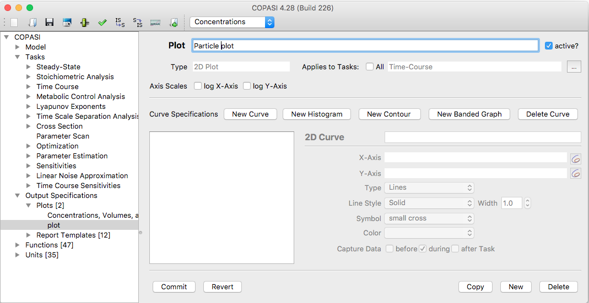
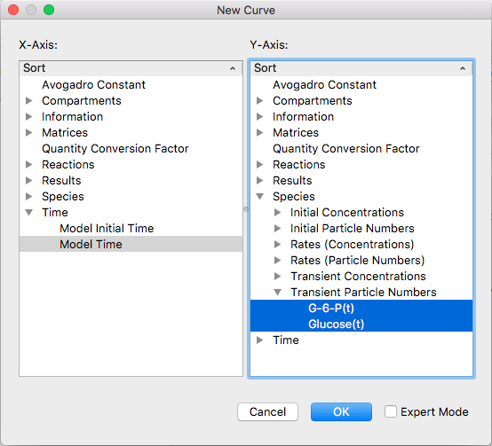
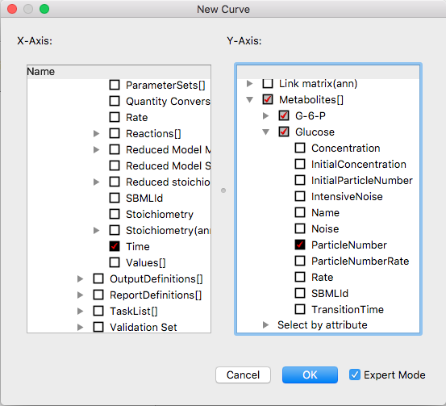
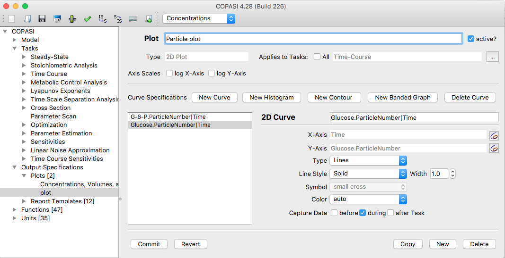
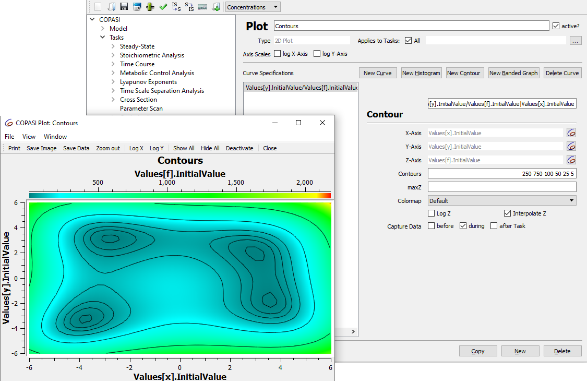
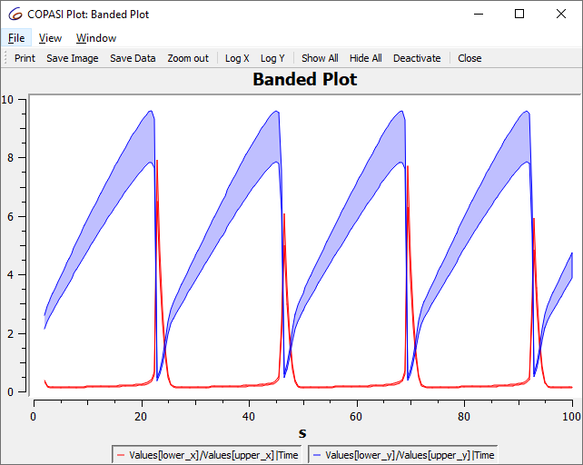

Plotting is another output option provided by COPASI. Most often, you
will want to visualize the concentrations of one or more species during a
time course simulation. This is most easily accomplished by selecting a
predefined plot template in the
[Output Assistant]({{ site.baseurl }}/Support/User_Manual/Output/Output_Assistant/).
However, the Output Assistant cannot accommodate every possible plot you
might need, so there are times when you'll want to define custom plots.

Currently, COPASI supports only two-dimensional plots. To create your own
plot, go to the Output → Plots section in the object tree and open the plot
definition dialog. Each plot consists of one or more curve or histogram
objects. To add a new curve, click the `New curve...` button.

  <table cellpadding="0" cellspacing="0">
    <tr>
      <td></td>
    </tr>
    <tr>
      <td class="mini">Empty&nbsp;Plot&nbsp;Widget</td>
    </tr>
  </table>

When you add a new curve to your plot, a selection dialog opens—similar
to the one described in the [report creation section]({{ site.baseurl }}/Support/User_Manual/Output/Manual_Definition/Reports/).
The main difference is that there are now two tree views side by side
instead of just one.

- The **left tree** is a single-selection dialog where you specify the object
  to be shown on the x-axis. For example, for a plot of concentration versus
  time, you would select simulation time here.
- The **right tree** allows multiple selections and lets you pick the objects
  to be displayed on the y-axis. In the case of a concentration vs. time plot,
  you might select one or more species concentrations.

As with report definitions, you can choose between a simple tree view and a
full tree view. For most plotting tasks, the simple tree provides everything
you need.

  <table cellpadding="0" cellspacing="0">
    <tr>
      <td></td>
    </tr>
    <tr>
      <td class="mini">Selection&nbsp;Dialog&nbsp;with&nbsp;some&nbsp;Items&nbsp;selected</td>
    </tr>
  </table>

 
 

  <table cellpadding="0" cellspacing="0">
    <tr>
      <td></td>
    </tr>
    <tr>
      <td class="mini">Expert&nbsp;Selection&nbsp;Dialog&nbsp;for&nbsp;Curve&nbsp;Objects</td>
    </tr>
  </table>

Once you have finished making your selections, click the **OK** button to return
to the curve definition dialog. For each object you chose from the right-side
tree, a corresponding tab will appear in the curve definition area—each tab
represents a curve object for your plot.

To remove a curve, select its tab and click the **Delete curve** button. The
next time you run a [time course simulation](
{{ site.baseurl }}/Support/User_Manual/Tasks/Time_Course_Simulation/), any plot
marked as **active** will be plotted automatically. The process for marking a
plot as active is described below. You can also choose which tasks can trigger a
plot. By default, a plot will apply to all tasks, but you can disable this
option and select specific tasks by adjusting the task selection checkbox.

Another way to set whether a plot is active is in the plot table, where all
plots are listed. Each row includes an **active** column with a checkbox you
can use to toggle the plot's status. If you change the state of one or more
plots, you must commit your changes either by clicking the **Commit** button or
by performing another action that commits changes (see the [compartments](
{{ site.baseurl }}/Support/User_Manual/Model_Creation/Compartments/)
section for more details).

You can also specify if the plot should use a logarithmic scale for either or
both axes.

### 2D Curves

Each curve object has a title and defines what is shown on the x- and y-axes.
Additionally, you can specify—for each curve—whether it should be drawn as a
line, as points, or as symbols.

  <table cellpadding="0" cellspacing="0">
    <tr>
      <td></td>
    </tr>
    <tr>
      <td class="mini">Curve detail settings</td>
    </tr>
  </table>

In the plot definition dialog, you can add or remove curve objects, assign a
name to your plot, and specify if the plot should be active using the **active**
checkbox. *Only* plots marked as active are displayed when you run a [time
course simulation]({{ site.baseurl
}}/Support/User_Manual/Tasks/Time_Course_Simulation/).

### Histograms

Besides curves, COPASI can generate a histogram of the data from a time course
simulation (see [time course simulation]({{ site.baseurl
}}/Support/User_Manual/Tasks/Time_Course_Simulation/)) or a parameter scan (see
[parameter scan]({{ site.baseurl
}}/Support/User_Manual/Tasks/Parameter_Scan)). A histogram is a bar graph that
shows how frequently a parameter takes particular values.

To define a histogram instead of a curve, click the **New histogram...** button
in the plot definition dialog. You can specify a title, the variable to display,
and the increment value—the width of each histogram bar. For example, if your
parameter ranges from 3 to 8 and you set the increment to 0.1, COPASI will draw
a histogram with 50 bars, each representing a value range of 0.1 units. Curves
and histograms may be combined in a single plot.

### Contour Plots

You can also define contour plots by clicking the **New Contour** button. For a
contour plot, you specify values along three axes. The z-axis values are
represented with a color map. You can define specific values for which contour
lines should appear.

  <table cellpadding="0" cellspacing="0">
    <tr>
      <td></td>
    </tr>
    <tr>
      <td class="mini">Contour plot settings</td>
    </tr>
  </table>

 

### Banded Curves

To add a banded curve to your plot, click the *New Banded Graph* button in
the plot definition dialog. For a banded curve, you specify one value for
the x-axis and two values for the y-axis. COPASI will then display a band
between the two y-values for each x position.

  <table cellpadding="0" cellspacing="0">
    <tr>
      <td></td>
    </tr>
    <tr>
      <td class="mini">Banded curve</td>
    </tr>
  </table>

 
