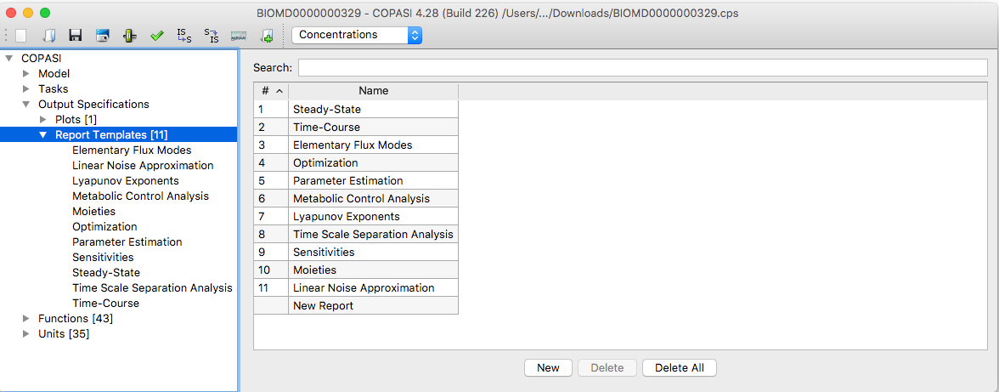
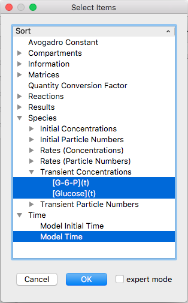
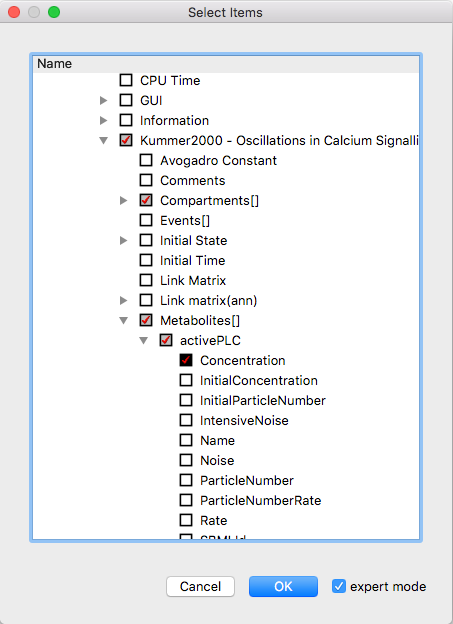
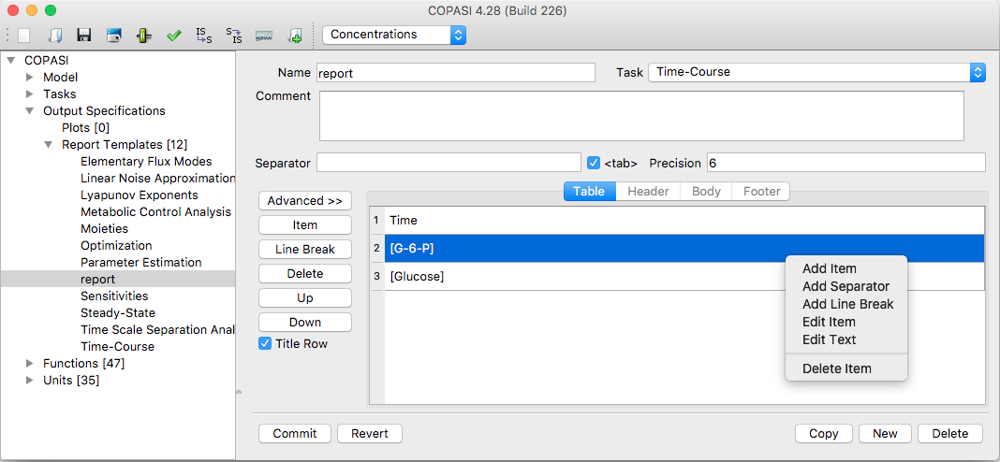
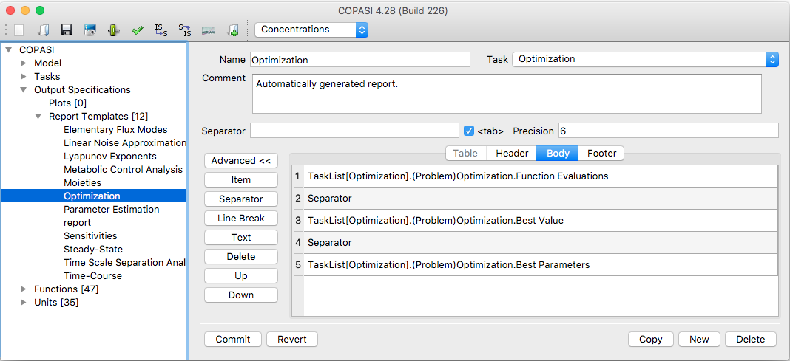

This section explains how to create and edit a report definition in COPASI.
Remember that, after creating a report definition, you must select it for use
with a specific calculation task. To do this—and to choose the output filename—
use the **Report** button, as described in the sections about the individual
tasks.

  <table cellpadding="0" cellspacing="0">
    <tr>
      <td></td>
    </tr>
    <tr>
      <td class="mini">Report&nbsp;Table&nbsp;with&nbsp;default&nbsp;Reports</td>
    </tr>
  </table>

The dialog for creating and editing report definitions is found under the
**Output Specifications → Reports** branch in the object tree. To make a new report,
double-click on an empty row in the table. This action will create a new
report and open the dialog where you can edit its settings.

In the report definition dialog, you can set a name for your report in the
**Name** field. The **Task** dropdown lets you choose the calculation task the
report will be associated with. For example, choose **Time-Course** if you are
generating a report for a time course simulation.

Reports are commonly saved in a table format, with each line representing a
record of simulation results (e.g., one line per time step). By default, table
columns are separated by a tab character (`\t`). If you want to use a different
separator, uncheck the `<tab>` box and specify your desired character or string
in the **Separator** field.

Next to the separator option, there's a **Precision** field where you can set
how many significant digits will be used for numbers in the output. The default
precision is 6 digits.

Optionally, you may add a **Comment** to describe the purpose or contents of the
report. The comment will not appear in the report, it is only there for display
in COPASI. If you wanted a comment in the report, you'd create it manually in the 
Header or Footer in the advanced mode, see below.

Now you need to define which objects will appear in your report. There are two
modes for defining a report:

- **Table Layout** (default): The report is structured as a table, useful for
  most tasks (such as logging simulation results at each step). For example, a
  time course report often contains time values and species concentrations, each
  as columns in the table.

- **Advanced Mode**: Click the **Advanced** button to activate this mode. Here,
  you can separately define the content of three sections in your report: the
  header, body, and footer. Use the corresponding tabs to set up each section.
  If you return from advanced mode to the standard table layout by clicking
  **Advanced** again, COPASI will warn you that information may be lost in the
  conversion.

For most use cases, the table layout suffices. To include objects in your
report, click the **Item** button. This will open the object browser dialog,
where you can select the specific model objects you wish to add to the report.

  <table cellpadding="0" cellspacing="0">
    <tr>
      <td></td>
    </tr>
    <tr>
      <td class="mini">Simple&nbsp;Object&nbsp;Selection&nbsp;Dialog</td>
    </tr>
  </table>

The selection dialog displays a tree structure containing the objects most 
commonly used to generate reports, plots, sliders, and related outputs. To 
select objects, click on the corresponding leaves in the tree view. For both 
plots and reports, the simple selection dialog allows you to select multiple 
objects at once. To select a continuous range of objects, click the first object, 
then hold down the **SHIFT** key and click the last object in the range. To 
select or deselect individual objects in a non-continuous selection, hold down 
the **CTRL** key while clicking. Selecting an entire branch in the selection dialog 
will automatically select all leaves under that branch.

If the simple selection dialog does not show the object you want to include in 
your report, you can enable the expert mode by checking the **Expert Mode** box. 
This activates an extended tree containing all objects known to COPASI. In this 
tree, objects belonging to your model appear under a branch named after your 
model; since the branches are sorted alphabetically, the position of this branch 
varies. Selections made in either the simple or the expert tree are preserved 
when you switch between modes. Each branch in the full tree has a checkbox with 
three possible states: 
- Unchecked, meaning no objects in that subtree are selected.
- Checked with a black background, indicating all objects in that subtree are 
  selected.
- Checked with a gray background, indicating some (but not all) objects in the 
  subtree are selected.

  <table cellpadding="0" cellspacing="0">
    <tr>
      <td></td>
    </tr>
    <tr>
      <td class="mini">Object&nbsp;Browser&nbsp;Dialog&nbsp;Expert&nbsp;Mode</td>
    </tr>
  </table>

Most objects in the object selection tree appear in multiple places due to
the structure of the model. This is normal: selecting certain nodes may
influence the selection state of related branches. For example, if you
select the entire *Compartments* branch, all contained species will also
be selected automatically. As a result, the *Species* branch may also
appear as fully selected when you choose *Compartments*.

Suppose you want to define a report for a trajectory (time course) task in
Expert Mode. In this case, you will likely want to include *time* and one or
more of the transient concentrations of the species in your report. To select
the time variable, locate it as the last item in the *Model* branch and
click its checkbox. To add concentrations for all species, expand the
*Species* sub-branch within the *Model* branch, then open the *Select by
attribute* branch. Here, you can select the *Concentration* attribute—doing
so will automatically include the concentrations for all species.

If you only want some species concentrations, expand the individual species in
the *Species* branch and select the *Concentration* attribute only for those
you want to include. If your model has many species and you wish to include
all except one, it is often faster to first select all concentrations via
*Select by attribute*, then deselect the specific concentration(s) you do not
want, rather than selecting species individually.

Once you have finished selecting the objects for your report, click the **OK**
button in the selection dialog. The selected objects will now be listed in the
report definition dialog.

  <table cellpadding="0" cellspacing="0">
    <tr>
      <td></td>
    </tr>
    <tr>
      <td class="mini">Report&nbsp;Definition&nbsp;Dialog</td>
    </tr>
  </table>

The selected objects will appear in the report in the exact order in which they
are listed. To reorder them, select an entry and use the up or down buttons on
the left side of the list. For example, it is often helpful to move the time
object to the top so it appears as the first column in your output file, which
is the convention most programs expect. To remove unwanted items, simply select
them and click the Delete button.

The final step is to link your report definition to an output file. This
connection is made in the dialog for the specific task. We will describe this
process in detail when we cover running individual tasks.

The report you have defined is generated as a table. For a time course
simulation, the output will typically contain one line per simulation time
step. Each line lists the values of each selected object, separated by your
chosen separator character (usually the `<tab>` character).

By default, COPASI enables the "Title Row" checkbox. When checked, COPASI
writes a header row at the top of the table containing the names of the
selected objects—each corresponding to a table column. If you do not want a
header row in your output, simply uncheck this option.

  <table cellpadding="0" cellspacing="0">
    <tr>
      <td></td>
    </tr>
    <tr>
      <td class="mini">Advanced&nbsp;Report&nbsp;Definition&nbsp;Dialog</td>
    </tr>
  </table>

### Advanced Report Definition

The advanced report definition feature lets you customize the output for three
separate sections: the *header*, *body*, and *footer* of your report.

- The **header** section is written once at the beginning of the report, before
  the task starts.
- The **body** section is written once per step of the corresponding task (for
  example, once per time point in a time course simulation).
- The **footer** section is added once the task has finished.

A standard table report in COPASI is essentially a specific case of an advanced
report: the header contains the title row, the body consists of time and species
concentration values separated by your chosen separator, and the footer is left
empty. In advanced report definitions, you are responsible for placing separator
items wherever needed.

The benefit of the advanced report definition is that you can include any text,
labels, or formatting you choose in any of the three sections, giving you
greater flexibility. All other functionality is the same as for standard report
definitions: you can add and remove items using the object browser dialog,
reorder items with the up and down buttons, and insert separator items with the
Separator button. The symbol or text that serves as the separator is defined by
the checkbox and input field at the top of the report definition dialog.

## Example: Report for a Parameter Scan

To use advanced report definitions with Parameter Scans, first enable the 
advanced settings for the report. In this mode, a report is divided into 
three sections: **Header**, **Body**, and **Footer**.

These sections map directly to the "before", "during", and "after" output 
options of the [Parameter Scan](../../../Tasks/Parameter_Scan/) Sub Task:

- **Header**: Corresponds to "before". The header is printed once at the 
  beginning of each subtask iteration when "before" is selected. If you 
  select "before" in the Parameter Scan, only a single header is printed 
  for the entire scan.
- **Body**: Corresponds to "during". The body prints the end result of 
  each iteration of the parameter if nothing is selected, or transient 
  values for each subtask step if "during" is chosen (the subtask must 
  support a "during" state, e.g., a Time Course).
- **Footer**: Corresponds to "after". The footer is printed only once at 
  the end of the entire Parameter Scan, not after every subtask iteration.

**Note:** Selecting "after" in the Sub Task Output will produce only a 
single footer at the end of the whole Parameter Scan, not one after every 
iteration. If no output option is selected, the report will contain the 
end results of every iteration, as taken directly from the Parameter Scan.

Here are some guidelines for using the correct output mode:

- To add a heading before each iteration, select "before" and include it 
  in the header section.
- To track how something (such as species concentrations or sensitivities) 
  changes during a subtask, select "during" and include the relevant items 
  in the body section.
- To capture only the final results of each subtask, select nothing (leave 
  "after" unselected) and put the results in the body section.

**Example:**  
If you want a report that records every MCA or Steady State result, create 
a report template with the results in the Body section, and select no 
output option (leave "after" unselected) in the Sub Task Output for the 
Parameter Scan.

**Tip:**  
When editing a template, such as the Steady State Report Template, open the 
Footer section. You can right-click on the "Steady State Results" item and 
select "Edit Text". In the text editor, you can copy the entire Steady 
State Results section and paste it into your new report. This method is 
typically easier than searching for the correct item in expert mode.

**Exception:**  
An exception to these rules applies to the Time Course task (and tasks
dependent on it, such as Cross Section and Time Course Sensitivities). For
these tasks, results are *not* written into the Time Course Results when the
Parameter Scan output option is left unselected ("after" not chosen). However,
because the Time Course updates species concentrations (or particle numbers) in
the math container after each simulation step, you can report these transient
values instead.

To obtain such output, be sure to define a Sub Task Output at "during" for the
Sub Task—this is required for Parameter Scan to properly record time-dependent
results. The same approach applies to Cross Section outputs.

For Time Course Sensitivities, you can select "Sensitivities" in the Report
definition to record the results produced by this task.
