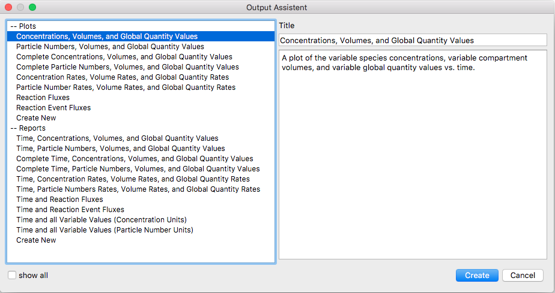

The Output Assistant in COPASI provides the simplest way to create your own
output definitions, which you can later customize using the instructions in
the [Manual Definition]({{ site.baseurl }}/Support/User_Manual/Output/Manual_Definition/)
section. Most task dialogs in COPASI include an "Output Assistant" button at
the lower right corner. Clicking this button opens a dialog with a list of
predefined output definitions on the left. When you select one, a brief
description of the output appears on the right side of the dialog. Above this
description is the title of the selected output definition. You can change
this title to easily distinguish between multiple output definitions of the
same type. Using this dialog, you can create both plots and reports.

To create an instance of the selected output object, simply click the "Create!"
button at the bottom of the dialog. After clicking, a new report or plot
(depending on your choice) appears in the appropriate branch under the Output
Specification section of the model tree. This branch is the second-to-last branch on
the left side of the tree. The name of the output definition matches the title
you entered. If a definition with the same name already exists, COPASI will
append a postfix to make the name unique. You can edit or delete the new
output as needed.

If the output you created is a report, it will automatically be set as the
active report for the current task. You will still need to select a filename
for the output using the Report button; this is explained in sections about
the specific calculation tasks. The following sections will describe how to
create, edit, and delete output definitions manually. When an **active** report 
of a task is deleted, it will also be removed from the task.

  <table cellpadding="0" cellspacing="0">
    <tr>
      <td></td>
    </tr>
    <tr>
      <td class="mini">Output&nbsp;Assistant&nbsp;Window</td>
    </tr>
  </table>

 
 
