This section demonstrates how to use COPASI’s cross section task. We start by
importing an oscillating model from the BioModels Database, explore its dynamics
with a time course simulation, and then extract characteristic events using the
cross section task.

## The Model

First, download [BioModel 239](https://www.ebi.ac.uk/biomodels/BIOMD0000000329)
from the BioModels Database. Import this model into COPASI. Then, navigate to
the **Tasks** section, and select **Time Course**. Set the duration to 100
seconds and use the automatic interval size. 

To visualize the simulation run, use the output assistant to create a plot for
“Concentrations, Volumes, and Global Quantity Values.” Click “Hide All,” then
select “[Calcium]” to show just its trace. The output will be similar to:

  <table cellpadding="0" cellspacing="0">
    <tr>
      <td>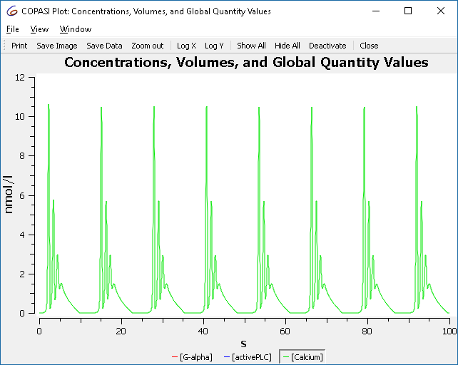</td>
    </tr>
    <tr>
      <td class="mini">Concentration time course of BioModel 239</td>
    </tr>
  </table>

To understand how changing a parameter affects the simulation, use COPASI’s
slider feature. Select **Tools > Show Sliders** or click the slider icon  in the toolbar. Click *New Sliders* and select the
“constant” parameter of reaction R2.

  <table cellpadding="0" cellspacing="0">
    <tr>
      <td>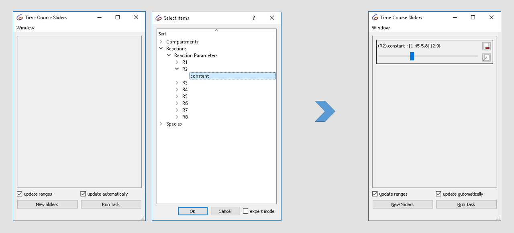</td>
    </tr>
    <tr>
      <td class="mini">Defining a slider</td>
    </tr>
  </table>

The initial value is 2.9. Try changing it from 1.5 to 3 while observing the plot.
You’ll see the oscillatory dynamics switch from basic oscillations to bursting:

  <table cellpadding="0" cellspacing="0">
    <tr>
      <td>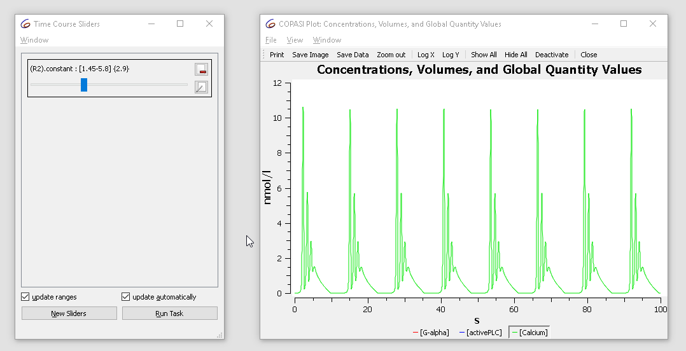</td>
    </tr>
    <tr>
      <td class="mini">Concentration time course while varying the slider</td>
    </tr>
  </table>

## Cross Section

The cross section task lets you detect when the system crosses a specified value
of a variable (a "surface" in phase space), in a specified direction. For this
tutorial, we identify the maxima (peaks) of the previously observed calcium
oscillations. Select the rate of calcium as the variable in the cross section
task, detect crossings of the value zero **in the negative direction**, and stop
detection after 100 seconds.

  <table cellpadding="0" cellspacing="0">
    <tr>
      <td>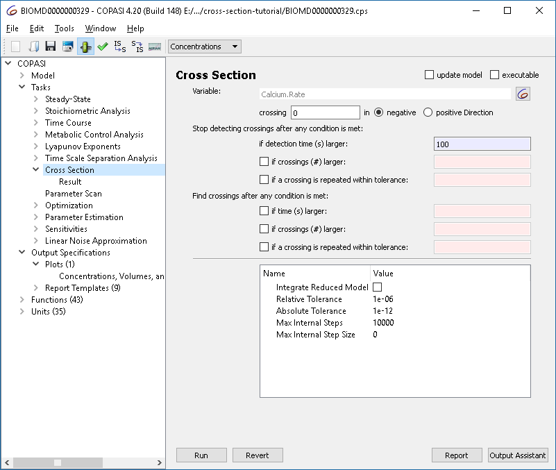</td>
    </tr>
    <tr>
      <td class="mini">Cross section task options</td>
    </tr>
  </table>

To visualize results, modify the plot so that values are shown as circles rather
than lines:

  <table cellpadding="0" cellspacing="0">
    <tr>
      <td>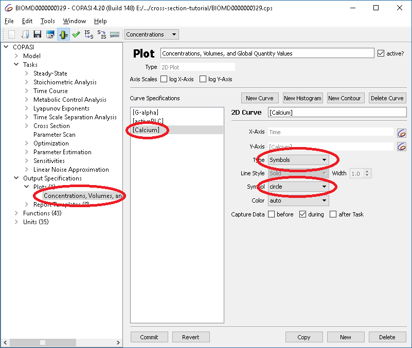</td>
    </tr>
    <tr>
      <td class="mini">Changing plot options</td>
    </tr>
  </table>

Now, run the cross section task and you will obtain:

  <table cellpadding="0" cellspacing="0">
    <tr>
      <td>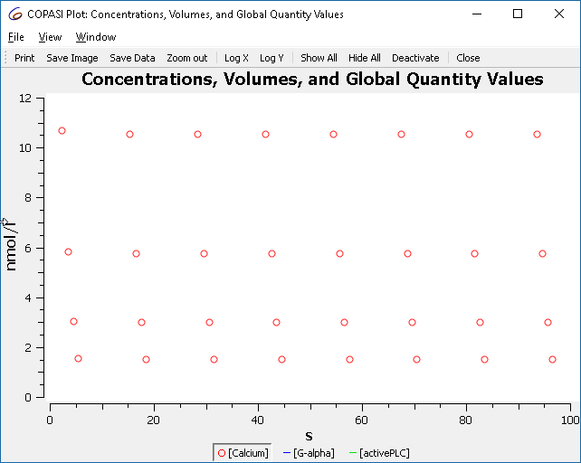</td>
    </tr>
    <tr>
      <td class="mini">Plot of cross section result, showing only maxima</td>
    </tr>
  </table>

These points correspond to the maxima observed earlier.

## Creating a Bifurcation Diagram

The oscillation behavior changes when adjusting reaction R2's parameter.
We can systematically illustrate this using a **scan task** in combination with
the cross section task to generate a bifurcation diagram.

1. Define a scan over `R2.constant`, varying it in 100 intervals from 1.5 to 3.
2. Set the subtask to “Cross Section.”
3. Enable “output during subtask execution.”

  <table cellpadding="0" cellspacing="0">
    <tr>
      <td>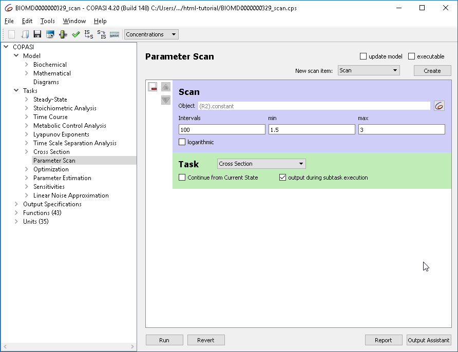</td>
    </tr>
    <tr>
      <td class="mini">Defining the parameter scan</td>
    </tr>
  </table>

For the plot, set `R2.constant` as the x-axis and calcium concentration as the
y-axis. Use circles for points. (Alternatively, the output assistant’s “Scan of
Concentrations, Volumes and Global Quantity Values” is suitable.)

  <table cellpadding="0" cellspacing="0">
    <tr>
      <td>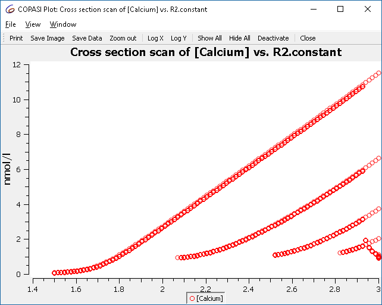</td>
    </tr>
    <tr>
      <td class="mini">Scan result: single to multiple peaks (bursting)</td>
    </tr>
  </table>

This plot shows **all maxima**, not just those from the limit cycle. To filter
for relevant crossings, configure the cross section task to only collect
crossings after a certain condition, e.g., when “time > 50”.

  <table cellpadding="0" cellspacing="0">
    <tr>
      <td>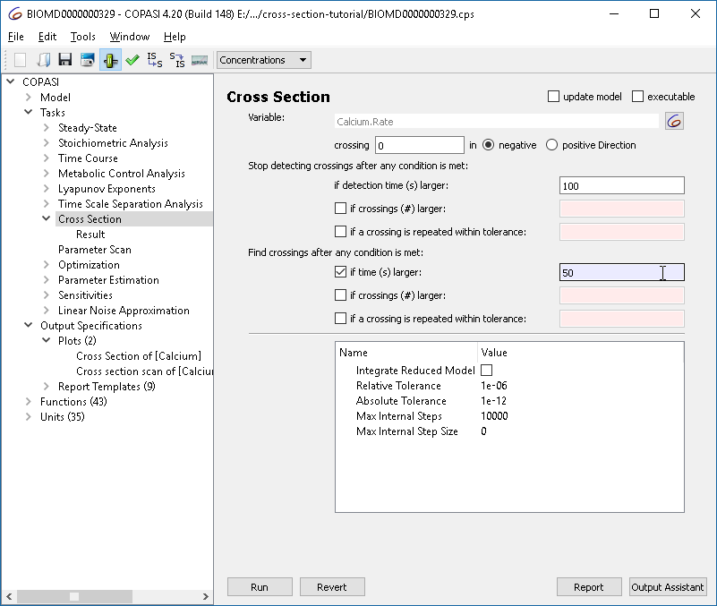</td>
    </tr>
    <tr>
      <td class="mini">Refining the cross section task: collect after limit cycle</td>
    </tr>
  </table>

Re-running the parameter scan now yields only those crossings of interest:

  <table cellpadding="0" cellspacing="0">
    <tr>
      <td>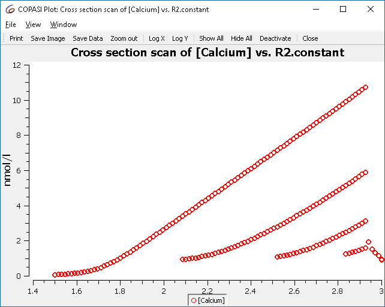</td>
    </tr>
    <tr>
      <td class="mini">Refined scan result</td>
    </tr>
  </table>

### Cross Section Task Options

The cross section task has options to efficiently find crossing points. They
fall into two groups:

  <table cellpadding="0" cellspacing="0">
    <tr>
      <td>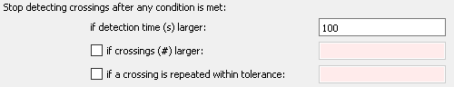</td>
    </tr>
    <tr>
      <td class="mini">Cross section termination options</td>
    </tr>
  </table>

**First Group: When to Stop Collecting Crossings**
- *If crossings (#) larger*: Stop after a set number of crossing points.
- *If a crossing is repeated within tolerance*: Stop if crossing points start
  repeating (within a set relative accuracy), typically indicating a limit
  cycle.

**Note:** You must set a maximum simulation time to ensure simulation ends even
if crossings are absent or not repeating.

  <table cellpadding="0" cellspacing="0">
    <tr>
      <td>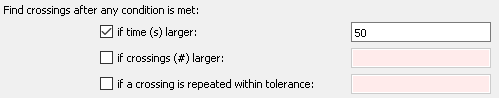</td>
    </tr>
    <tr>
      <td class="mini">Cross section collection options</td>
    </tr>
  </table>

**Second Group: When to Start Reporting Crossings**
- *If crossing (#) larger*: Begin reporting after a set number of crossings.
- *If a crossing is repeated within tolerance*: Start only once crossings
  reoccur within the given tolerance. This helps when looking for a limit
  cycle, but isn’t useful for chaotic dynamics.

**Complete Example Download:**  
[Download BIOMD0000000329_scan.cps](./BIOMD0000000329_scan.cps)

[Run in COPASI](copasi://process?downloadUrl=https%3A%2F%2Fraw.githubusercontent.com%2Fcopasi%2Fcopasi.github.io%2Frefs%2Fheads%2Fmaster%2FSupport%2FUser_Manual%2FTasks%2FCross_Section%2FBIOMD0000000329_scan.cps&activate=%22Cross%20Section%22&createPlot=none&runTask=none)

---

## Example 2: Route to Chaos via Period Doubling

As another example, we illustrate the route to chaos through period doubling
bifurcations using a chemical-kinetics analog of Rössler’s chaotic attractor
[[1]](#refs),[[2]](#refs).

As before, set up the cross section task to detect maxima of a variable (`X2`).
Recommended settings:
- Start plotting after at most 50 oscillations, or sooner if a limit cycle is
  detected (accuracy: 1e-5).
- Stop plotting after 1000 time units or after 50 maxima are detected,
  whichever comes first. Also stop earlier if a limit cycle is found.

  <table cellpadding="0" cellspacing="0">
    <tr>
      <td>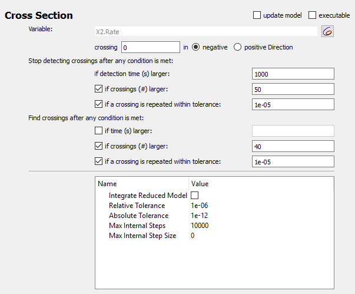</td>
    </tr>
    <tr>
      <td class="mini">Cross section options for chaotic example</td>
    </tr>
  </table>

The scan task scans the autocatalytic expansion parameter from 0.05 to 0.2.
Define a plot with the scan parameter on x-axis and X2 concentration on the
y-axis.

  <table cellpadding="0" cellspacing="0">
    <tr>
      <td>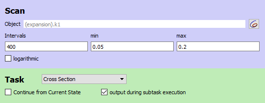</td>
    </tr>
    <tr>
      <td class="mini">Scan settings for chaotic example</td>
    </tr>
  </table>

This yields the classic Feigenbaum (period doubling) diagram:

  <table cellpadding="0" cellspacing="0">
    <tr>
      <td>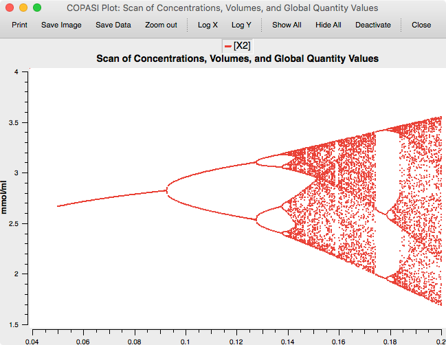</td>
    </tr>
    <tr>
      <td class="mini">Feigenbaum diagram</td>
    </tr>
  </table>

**Complete Example Download:**  
[Download chaos3v2.cps](./chaos3v2.cps) 
[Run in COPASI](copasi://process?downloadUrl=https%3A%2F%2Fraw.githubusercontent.com%2Fcopasi%2Fcopasi.github.io%2Frefs%2Fheads%2Fmaster%2FSupport%2FUser_Manual%2FTasks%2FCross_Section%2Fchaos3v2.cps&activate=%22Cross%20Section%22&createPlot=none&runTask=none)

---

## References

[1] O. E. Rössler: An Equation for Continuous Chaos. Physics Letters Vol. 57A
no 5, pp 397-398, 1976.

[2] Baier, G., & Sahle, S. (1995). Design of hyperchaotic flows. Physical
Review E, 51(4), R2712–R2714.
[doi:10.1103/PhysRevE.51.R2712](https://doi.org/10.1103/PhysRevE.51.R2712)
