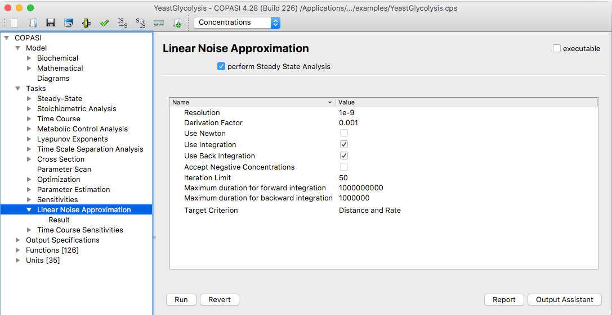

The **linear noise approximation** (LNA) is a method for estimating the
covariances between the particle numbers of different species in a stochastic
biochemical system. The LNA provides a way to analyze the magnitude and
structure of fluctuations around the average behavior predicted by deterministic
models, making it useful for understanding noise effects in reaction networks.

The settings for the LNA task, are the same as for the [steady state task](../Steady-State_Analysis/). 

  <table cellpadding="0" cellspacing="0">
    <tr>
      <td></td>
    </tr>
    <tr>
      <td class="mini">LNA Settings</td>
    </tr>
  </table>

### References

[1] Pahle, Jürgen, Joseph D. Challenger, Pedro Mendes, and Alan J. McKane.
“Biochemical Fluctuations, Optimisation and the Linear Noise Approximation.”
*BMC Systems Biology* 6, no. 1 (July 17, 2012): 86.  
<https://doi.org/10.1186/1752-0509-6-86>
