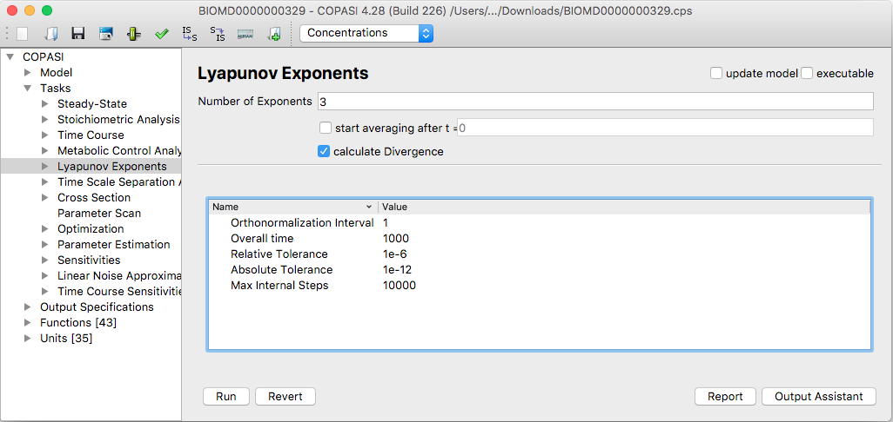
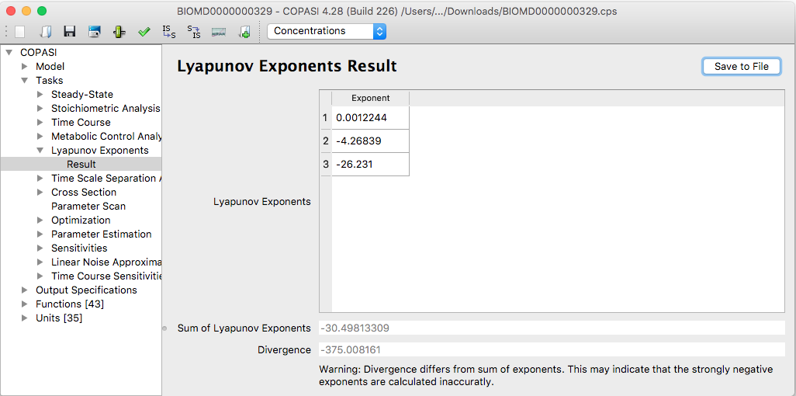

A Lyapunov exponent captures the average exponential rate at which nearby trajectories in a dynamical system diverge or converge, revealing whether the system behaves predictably or chaotically.

To calculate Lyapunov exponents in COPASI, go to the **Task** branch in the 
tree view and select **Lyapunov Exponents**. This will open the relevant widget. 
The first field, **Number of Exponents**, allows you to choose how many 
Lyapunov exponents to calculate. The value should be between one and the total 
number of independent variables in your system (i.e., the number of non-constant 
species minus the number of mass conservation relations). If you enter a number 
greater than allowed, COPASI will warn you and display the maximum possible 
value.

While calculating Lyapunov exponents, COPASI performs a time course simulation. 
If your model has a long transient phase, you may want to exclude the initial 
segment from the exponent calculation. You can set the time at which to start 
averaging the Lyapunov exponents using the field labeled 
`start averaging after t=`.

There is a checkbox labeled **calculate Divergence** that, when enabled, tells 
COPASI to compute the average divergence. The divergence is calculated as the 
average of the trace of the Jacobian (see 
[Lyapunov Exponents Calculation](../../Methods/Lyapunov_Exponents_Calculation/)).

Details about the calculation method and the meaning of parameters like 
**Orthonormalization interval** and **Overall time** are explained in the 
[Lyapunov Exponents Calculation](../../Methods/Lyapunov_Exponents_Calculation/) 
section.

  <table cellpadding="0" cellspacing="0">
    <tr>
      <td></td>
    </tr>
    <tr>
      <td class="mini">Lyapunov&nbsp;Task&nbsp;Dialog</td>
    </tr>
  </table>

After you click the **Run** button, COPASI will begin the time course simulation to
calculate the Lyapunov exponents. When the calculation is complete, COPASI will
automatically switch to the **Result** window. Here, the calculated Lyapunov
exponents are displayed in a table, with their sum shown below the table. If you
chose to calculate the divergence, this value will also appear beneath the sum of
the exponents.

  <table cellpadding="0" cellspacing="0">
    <tr>
      <td></td>
    </tr>
    <tr>
      <td class="mini">Results&nbsp;for&nbsp;the&nbsp;Lyapunov&nbsp;Exponent&nbsp;Calculation</td>
    </tr>
  </table>

If you requested COPASI to calculate all possible Lyapunov exponents (i.e., as
many as there are independent variables in the model), the sum of the exponents
and the divergence should match; if they do not, COPASI will display a warning.
This warning is only shown when all exponents have been calculated, as a
difference between the sum and divergence is expected otherwise.
