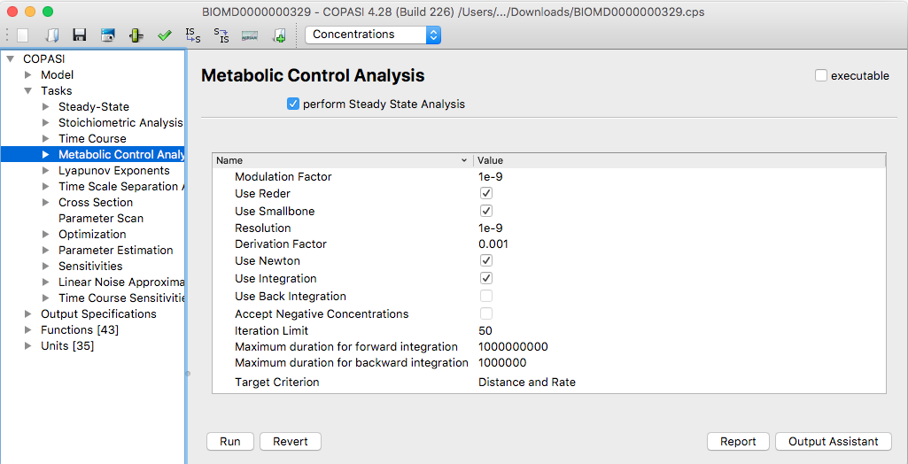
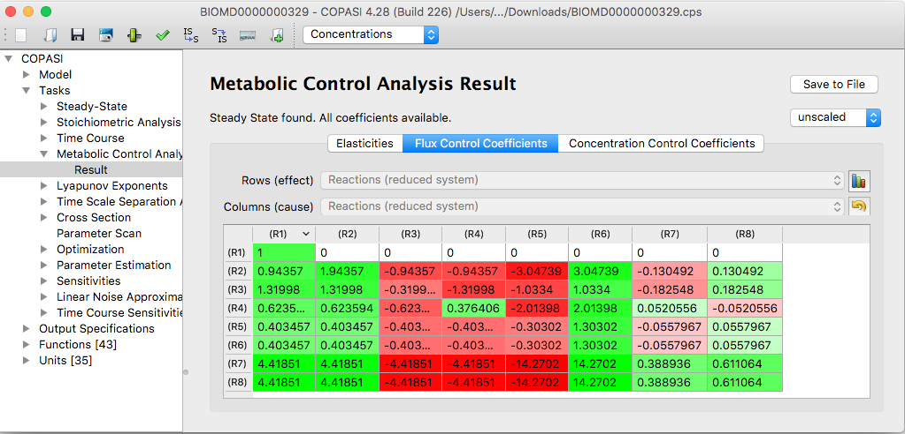
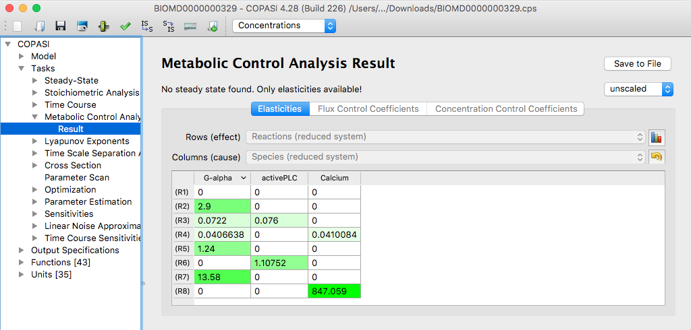

COPASI can perform a *Metabolic Control Analysis (MCA)* on your model.  
You can find the MCA task under **Tasks → Metabolic Control Analysis**.

To perform a full Metabolic Control Analysis (MCA), which includes calculation of 
both elasticities and control coefficients, COPASI first needs the system to be at 
steady state. Otherwise, only the elasticities can be determined. If you have not 
already run a Steady-State analysis and ensured the system is at steady state, 
enable the checkbox that instructs COPASI to perform a Steady-State calculation 
before proceeding with MCA. Depending on whether COPASI must run a Steady-State 
analysis or not, you may be able to adjust parameters that affect how both the MCA 
and Steady-State are computed. For more details about these settings, refer to the 
[Steady-State analysis](../Steady-State_Analysis/) section.

  <table cellpadding="0" cellspacing="0">
    <tr>
      <td></td>
    </tr>
    <tr>
      <td class="mini">MCA&nbsp;Task&nbsp;Dialog</td>
    </tr>
  </table>

To start the analysis, click the **Run** button. After the calculation concludes, 
COPASI automatically opens the Results dialog. This dialog contains three tabs: 
*Elasticities*, *Flux Control Coefficients*, and *Concentration Control Coefficients*.

  <table cellpadding="0" cellspacing="0">
    <tr>
      <td></td>
    </tr>
    <tr>
      <td class="mini">MCA&nbsp;Results&nbsp;at&nbsp;Steady-State</td>
    </tr>
  </table>

 
 

If a steady state was not found, only the *Elasticities* tab may be available. 
COPASI will indicate the status of the steady-state search just above the result 
tabs. For all results, you can choose to have COPASI display values in either scaled 
or unscaled form.

  <table cellpadding="0" cellspacing="0">
    <tr>
      <td></td>
    </tr>
    <tr>
      <td class="mini">MCA&nbsp;Results&nbsp;when&nbsp;no&nbsp;Steady-State&nbsp;was&nbsp;found, only Elasticities are displayed.</td>
    </tr>
  </table>

 
 

To obtain output from the MCA, you must connect the report to an output file. You 
can either create a custom report as described elsewhere or use the default report. 
The default report outputs all computed matrices as well as the steady-state results 
(if a steady-state calculation was performed). 

To write the report to a specific file, click the **Report** button, which opens 
a dialog allowing you to associate a specific MCA task report with a disk file. 
First, select a suitable report for the MCA task from the dropdown menu at the top 
of the dialog (the default is called *Metabolic Control Analysis*). Next, click the 
browse button to choose the output file's location. By default, COPASI creates a 
new file or overwrites an existing file with the specified name. Alternatively, you 
can have COPASI append the report to the end of an existing file by selecting the 
*Append* checkbox at the bottom of the dialog. When finished, click **Confirm**. 
Now, when you run the task, COPASI will save the output to your chosen file.

