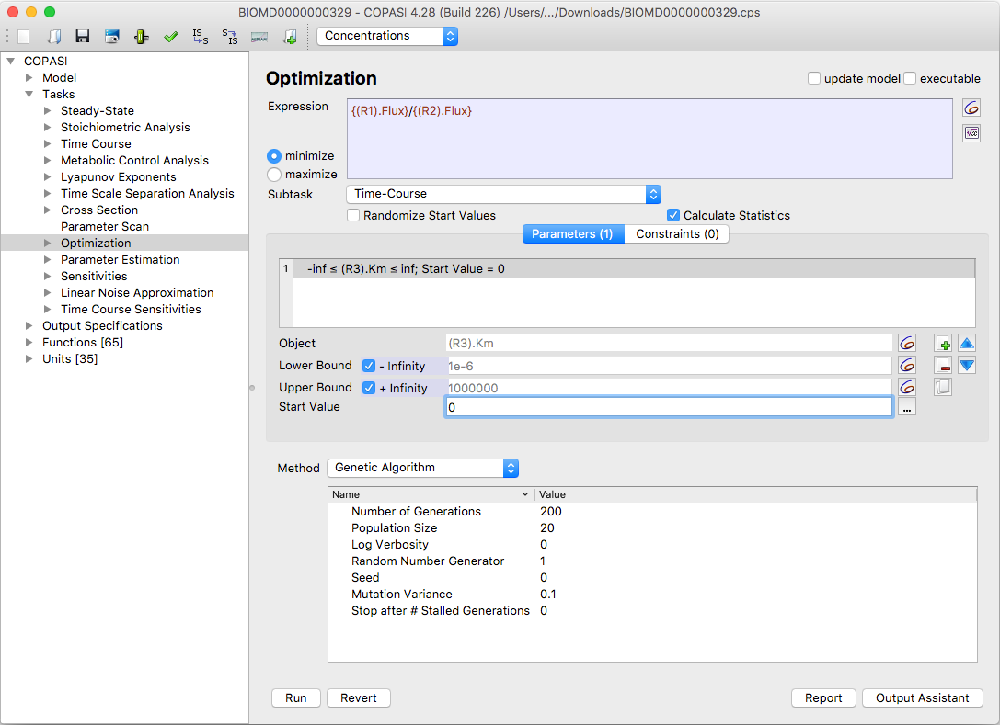
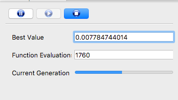

The optimization task in COPASI allows you to minimize an objective function
by adjusting one or more parameters within specified ranges. This concept may
sound abstract at first, so let's clarify it with a simple example.

Suppose you have a model with several reactions, and the fluxes of two of
these reactions (let's call them R1 and R2) are influenced by a particular
parameter, k (either directly or indirectly). Your goal is to determine the
optimal value of k that maximizes the ratio R1/R2. Next, we'll see how to
set this up in COPASI.

  <table cellpadding="0" cellspacing="0">
    <tr>
      <td></td>
    </tr>
    <tr>
      <td class="mini">Optimization Task&nbsp;Dialog</td>
    </tr>
  </table>
  

To access the Optimization dialog in COPASI, navigate to the tree view and 
select **Task → Optimization**. This will open a screen similar to the one 
shown above.

At the top of the Optimization dialog is an **Expression** field, where you 
enter your objective function, the expression that COPASI will try to 
minimize during optimization. For example, suppose you want to optimize the 
value of a parameter `k` so that the ratio of the fluxes through two 
reactions, `R1` and `R2`, is minimized. 

For this example, we’ll use the second approach (assuming both fluxes are 
always positive).

You cannot simply type `R1/R2` as the objective function, because COPASI 
does not directly recognize the names `R1` and `R2`. Instead, follow these 
steps:
1. Begin typing an opening parenthesis `(` in the Expression field.
2. Click the button to the right of the field to open the *Object Browser*.
3. In the Object Browser, select the flux value corresponding to reaction 
   `R1` and click **OK**. COPASI inserts the correct object reference into 
   your expression.
4. Manually type `/`, then repeat the object selection process for `R2`.
5. Close the expression with `)`.

**Note**: You may edit only the parts of the expression not formed by 
object references from the Object Browser. Object reference strings 
inserted via selection should not be modified directly, but you may delete 
an entire identifier if needed.

---

COPASI offers several optimization methods, selectable from the dropdown 
menu below the objective function field. Each method has its own parameters, 
which are detailed in the [Methods section](../../Methods/Optimization_Methods/).

The optimization task can be run on many different subtasks. You choose which 
one to use by selecting the corresponding check boxes. For the `R1/R2` example, 
you would usually select the **Time Course** option.

Next, you must specify which parameter(s) COPASI will optimize. In the 
middle section of the dialog, after the **Object** label, is another field 
allowing you to choose the parameter to scan. Click the adjacent button to 
open the Object Browser and select the correct parameter. You can specify 
multiple parameters if needed.

Below the **Object** field, supply upper and lower bounds for each 
parameter. The bounds can be numerical values or expressions involving other 
parameters. By default, the bounds are set to `-Infinity` and `+Infinity`, 
but since computers cannot truly handle infinite values, the optimization 
searches over the range of representable double precision numbers.

To use custom bounds, uncheck the **+Inf** or **-Inf** boxes and enter your 
desired limits. You can also specify limits relative to the start value 
(e.g., entering `+20%` sets the upper bound to 20% above the initial value). 
The **start value** is the initial estimate COPASI uses for optimization; by 
default, it uses the parameter's current value, but you may override it 
manually, randomize it, reset to model values, or set it to the most recent 
optimized result. If your start value is outside the specified bounds, COPASI 
will adjust it to the nearest allowed boundary.

To remove a parameter from the scan list, select it and click the **delete** 
button. Add more parameters with the **new** button; you may select and 
edit multiple parameters together. The order in which parameters appear 
matters only if the bounds of one parameter depend on another, COPASI does 
not track such dependencies automatically, so arrange as needed.

---

In addition to optimizing parameters, COPASI allows you to specify 
**constraints**. Constraints restrict the solution after each simulation 
step (whether a time course or steady-state calculation). For example, you 
could constrain the steady-state concentration of a species to lie within a 
given range. The **Constraints** tab lets you define each constraint as an 
object with upper and lower limits, using the same selection and entry 
process as for optimization parameters. Multiple constraints can be specified.

If the **Randomize Start Values** checkbox is enabled, COPASI will 
generate random starting values (within the specified bounds) for each 
optimization parameter.

The **Create Parameter Sets** checkbox, when enabled will cause COPASI to 
create [Parameter Sets](../../Model_Creation/Parameter_View/) with the
initial and the final state of the model.

---

Once you’ve configured parameters, constraints, and the objective function, 
click **Run** to begin optimization. While running, COPASI displays a 
progress dialog that shows the current best (smallest) objective function 
value found so far. Since this dialog closes automatically at the end, you 
may also want to define a report to log optimization results during the 
calculation.

  <table cellpadding="0" cellspacing="0">
    <tr>
      <td></td>
    </tr>
    <tr>
      <td class="mini">Optimization&nbsp;Progress&nbsp;Dialog</td>
    </tr>
  </table>
  

In most cases, the default report name **Optimization** is sufficient.
The default report includes a summary of all settings you provided for
the optimization run. It also outputs intermediate results whenever the
target value improves and concludes with a summary of the final result.

The easiest way to create a custom report is to use the
[output assistant]({{ site.baseurl }}/Support/User_Manual/Output/Output_Assistant/).
Alternatively, you can create a report manually, as described in the
[output section]({{ site.baseurl }}/Support/User_Manual/Output).

Once you have defined a report for the Optimization task, click the
**Report** button at the bottom of the dialog. In the dialog that opens,
select your desired report from the **Report Definitions** dropdown list,
then choose or type a filename in the **Target** field for where the report
should be saved. You can type the filename directly or click the Browse
button to select a location. When finished, click the **Confirm** button.

The next time you run the optimization, COPASI will save the report to the
location you specified.
