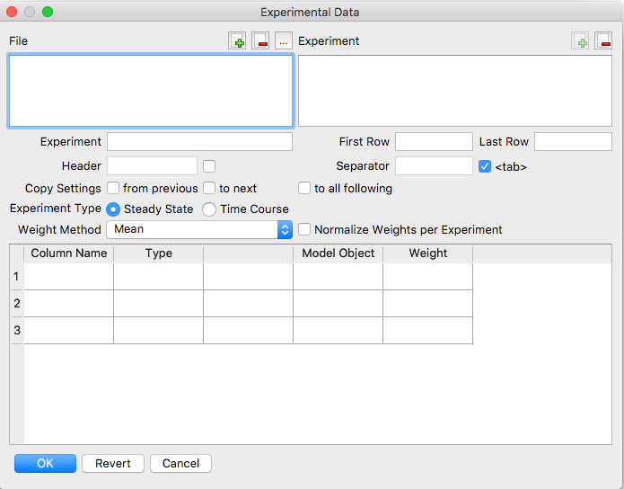

Before running a parameter estimation task, you must specify the experimental
dataset that COPASI will use to fit the parameters. This dataset can be provided
in one or more data files. Supported data files are delimited text files, usually 
either TSV or CSV files. A `<tab>` will be assumed initially, but you can specify
the delimiter your files uses.

Each file may contain one or more experiments, and
each experiment consists of one or more data columns. All data points from all
columns and experiments contribute to the objective function, which is defined
as a weighted sum of squared differences:

$$
E(P) = \sum_{i, j} \omega_j \cdot (x_{i, j} - y_{i, j}(P))^2
$$

Here, $P$ represents the current set of parameters being tested. $x_{i, j}$ is a
measured data point from the dataset, and $y_{i, j}(P)$ is the corresponding
simulated value. The indices $i$ and $j$ refer to the row (data point) and
column (data series) in the dataset, respectively. The weight $\omega_j$ is
assigned for each data column, and can either be specified by the user or
automatically calculated by COPASI. In the user interface, weights calculated by
COPASI are displayed in brackets.

Weights are designed to adjust the contribution of each data column to the
overall objective function, so that ideally data points from all columns
contribute equally. COPASI offers three main methods for calculating weights,
each based on a different assumption about how the residual error relates to the
data values. You can select the method using a dropdown in the user interface;
the available options are described in the table below. Depending on whether the
**Normalize Weights per Experiment** checkbox is checked, COPASI will either
scale the weights so that the largest weight among all columns in the dataset is
$1$, or scale the largest weight in each experiment separately to $1$.

If you wish to adjust weight values manually, simply type new values directly in
the table.

<table class="table table-striped" style="caption-side: top;">
  <caption>Weight Calculation Methods</caption>
  <thead>
    <tr>
      <th scope="col">Name</th>
      <th scope="col">Formula</th>
      <th scope="col">Comment</th>
    </tr>
  </thead>      
  <colgroup>
    <col width="20%" />
    <col width="40%" />
    <col width="40%" />
  </colgroup>
  <tbody>
  <tr>
    <td>Mean </td>
    <td> $\omega_{j}=\frac{1}{&lt;x_{j}&gt;^{2}}$</td>
    <td>Assumes the error scales with the mean of the data points in a column</td>
  </tr>
  <tr>
    <td>Mean Square </td>
    <td> $\omega_{j}=\frac{1}{&lt;x_{j}^{2}&gt;}$</td>
    <td>Assumes the error scales with the mean square of the data points in a column</td>
  </tr>
  <tr>
    <td>Standard Deviation </td>
    <td> $\omega_{j}=\frac{1}{&lt;x_{j}^{2}&gt; - &lt;x_{j}&gt; &lt;x_{j}&gt;}$</td>
    <td>Assumes the error scales with the standard deviation of the data points in a column</td>
  </tr>
  <tr>
    <td>Value Scaling</td>
    <td>---</td>
    <td>The <b>Value Scaling</b> option in the drop down menu selects an alternative scaling
    behaviour: In this case the contribution of each data point is scaled by the inverse of
    the data value, assuming a multiplicative error model.</td>
  </tr>
</tbody>
</table>

To specify the experimental data you click on the Experimental Data button at the top right of the parameter
estimation dialog. A new dialog opens that lets you enter experimental data.

  <table cellpadding="0" cellspacing="0">
    <tr>
      <td></td>
    </tr>
    <tr>
      <td class="mini">Experimental&nbsp;Data&nbsp;Dialog</td>
    </tr>
  </table>

To load a data file, click the **open** button next to the **File** label at the 
top of the dialog, and choose a file containing experimental data. The data file 
should include experimental data grouped into experiments. For COPASI to 
automatically detect where each experiment begins, experiments must be separated 
by one or more empty lines. Manual definition of experiments is also supported.

Each experiment's data must be arranged in a table, with columns separated by a 
user-definable delimiter. The default and recommended delimiter is the `<tab>` 
character. By default, the first line of each experiment is treated as the header 
row containing column names. However, you can choose which row serves as the 
header, and it may appear anywhere in the file. Including a header row is not 
mandatory; if your data lacks a header, uncheck the box indicating a header is 
present.

After COPASI loads a data file, you must provide additional information for each 
experiment included in the file. Select an experiment from the selection box on 
the right. The first property to define is whether the experiment data is for a 
steady-state analysis or a time course simulation.

Next, you need to associate each input data column with elements of the model. 
Use the `...` button in each row to open a selection dialog and choose the 
corresponding model object. COPASI requires that the type of each data column is 
specified. Each column can be one of four types:

<dl class="row">
  <dt class="col-sm-2"><b>ignored</b></dt>
  <dd class="col-sm-10"> Values in columns marked ignored are not taken into account during parameter fitting. Columns of this type
    may not be associated with elements of the model.</dd>

  <dt class="col-sm-2"><b>independent</b></dt>
  <dd class="col-sm-10"> Independent data is data which needs to be set for the correct simulation of the experiment row. Possible
    model elements are initial concentrations or kinetic parameters. Note, for a time course experiment only the
    independent data in the first data row is set before the start of the simulation. Columns of this type must be
    associated with elements of the model.</dd>

  <dt class="col-sm-2"><b>dependent</b></dt>
  <dd class="col-sm-10"> The dependent data is the data, which COPASI tries to fit by minimizing the sum of squares between the
    simulated data and the experimental data. Columns of this type must be associated with elements of the model.
  </dd>

  <dt class="col-sm-2"><b>Time</b></dt>
  <dd class="col-sm-10"> This column type is only available for time course experiments. Obviously only one column with this data type
    may exist. COPASI attempts to automatically identify the column containing the time by looking at the column
    headers. You may correct COPASI's guess. This column may not be mapped to any model elements.</dd>
</dl>

The last column in each line of your experimental data file contains the weight
assigned to that data point. If COPASI calculates this value automatically
(using one of the available modes), it will be shown surrounded by brackets.
To specify your own weight, simply remove the brackets and enter the desired
value. If you want COPASI to return to automatic calculation, delete the
contents of the box entirely, and COPASI will once again compute the weight
for you.

If you only wish to use part of an experiment’s dataset rather than the entire
set, you can indicate the start and end lines for the desired subset. You may
also remove experiments altogether. When you do this, the **New Document**
button will become enabled. Clicking this button adds the first unused
experiment from the currently active file. Often, all experimental data within
a file shares the same structure. COPASI makes it easy to copy experimental
data information from one experiment to another—use the **from previous** or
**to next** options to duplicate information as needed. If COPASI detects that
two experimental data sections are identical, it will automatically check the
**from previous** option and lock editing for the current experiment. To make
changes, simply uncheck this box.

If you have several data files, you can load each additional file and process
it in the same way. Once you're satisfied with your dataset definitions,
close the data dialog with the **OK** button. Before starting the parameter
estimation process, choose the desired fitting method and, if necessary,
adjust method parameters. In most cases, the default settings are sufficient.
Select the method from the drop-down list at the bottom of the dialog. For
further details on the available methods, please refer to the methods section.
