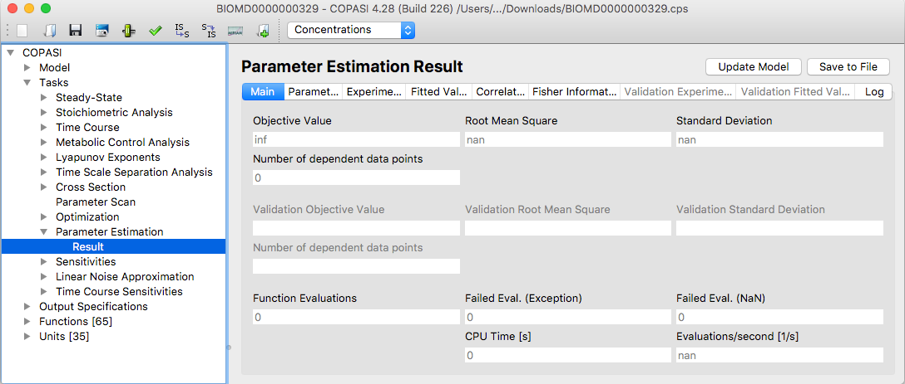

To save results from the parameter estimation task, you need to define an
output as described in the
[Output]({{ site.baseurl }}/Support/User_Manual/Output/) section.
You can use the default report named **Parameter Fitting**, which prints a
summary of your settings, intermediate results (whenever the target function
improves), and a detailed final result.

The easiest way to create a custom output is by using the
[Output Assistant]({{ site.baseurl }}/Support/User_Manual/Output/Output_Assistant),
which you can access via the **Output Assistant** button.

To write the results to a file, you must link an output definition to a
destination file. Click the **Report** button to open a dialog that allows you
to associate the report for a particular task with a file on your computer.
First, select a suitable report for parameter estimation from the drop-down menu
at the top of the dialog. Next, specify the output file by clicking the **Browse**
button and choosing the location in the file dialog. By default, COPASI will
create a new file or overwrite an existing one with the same name. If you prefer
to append the results to an existing file, select the **Append** checkbox at the
bottom of the dialog. When you are done, click **Confirm**. The next time you run
the task, COPASI will write the output to the file you selected.

  <table cellpadding="0" cellspacing="0">
    <tr>
      <td></td>
    </tr>
    <tr>
      <td class="mini">Parameter&nbsp;Estimation&nbsp;Results</td>
    </tr>
  </table>

After completing a Parameter Estimation task, you can review the results by 
opening the **Result** widget. The Result widget displays several tabs. The 
**Main** tab shows the overall fit and performance statistics for your task. 
Other tabs provide detailed information about each parameter, experiment, and 
the fitted values. Additional tabs may present the parameter correlation 
matrix and the Fisher information matrix, enabling deeper analysis of the 
estimation's quality and parameter relationships.
