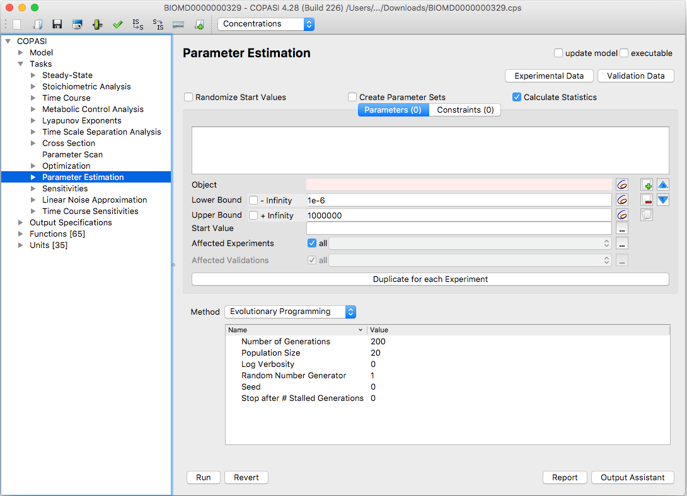

Parameter estimation is the process of determining model parameters using a dataset.
This dataset can come from time course experiments, steady-state experiments, or a
combination of both. COPASI is able to import a dataset, which may span across
multiple files and contain several experiments.

Once you have loaded your dataset, COPASI fits one or more user-specified parameters
to that data. The algorithms COPASI employs to estimate suitable parameter values
are the same as those available in the optimization task. For more information
on the various methods used, please refer to the methods section of this document.

  <table cellpadding="0" cellspacing="0">
    <tr>
      <td></td>
    </tr>
    <tr>
      <td class="mini">Parameter&nbsp;Task&nbsp;Estimation&nbsp;Dialog</td>
    </tr>
  </table>

If the **Randomize Start Values** checkbox is enabled, COPASI will generate a 
random start value within the defined bounds for each parameter you wish to 
estimate.

If the **Create Parameter Sets** checkbox is enabled, a new parameter set will 
be saved for each defined experiment, containing the best solution found as well 
as the original parameter values. Each parameter set is marked with the current 
timestamp and can be found under  
*Model → Biochemical → Parameter Sets*.

To open the parameter estimation dialog, select the **Parameter Estimation** 
branch under **Multiple Tasks** in the tree view on the left side of the user 
interface. You can define which parameters COPASI should fit—parameters are 
added in the same way as in the Optimization task. Click the button next to the 
**Object** field to open a selection dialog and choose the parameter you want 
to fit.

You can also specify upper and lower bounds for each parameter. COPASI will 
only fit parameters within these bounds. By default, the bounds are set to 
+Infinity (upper) and -Infinity (lower). To set your own bounds, uncheck the 
corresponding box and enter your desired value. Enter the lower bound in the 
field labeled "Lower Bound" and the upper bound in the field labeled "Upper 
Bound".

For convenience, you may also enter bounds as percentages (e.g., -X% or +X%), 
which instructs COPASI to calculate the limit based on the start value. If 
needed, you can use the button next to the edit field to choose another model 
object as a bound for the parameter.

The start value is the initial parameter value that COPASI uses for fitting. By 
default, this is set to the current value from the model. You can override this 
by entering your own value or by using the options in the menu (opened with 
"...") to reset to model values, randomize the value, or use the last estimated 
value. If the specified start value is outside the set bounds, COPASI will 
automatically adjust it to the nearest valid boundary during parameter 
estimation.

Additionally, you can restrict a parameter's effect to subset(s) of your 
experiments. To do this, select the "..." next to **Affected Experiments** and 
choose the relevant experiments. For use cases where initial values need to be 
fitted separately for each experiment (such as different starting concentrations 
in time course data), the **Duplicate for each Experiment** button will create 
a copy of the current parameter for each specified experiment.



