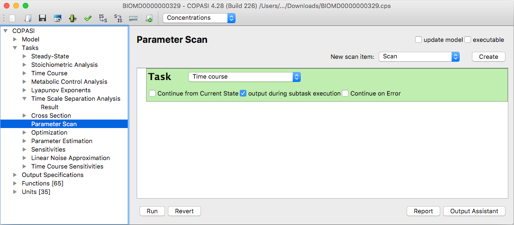
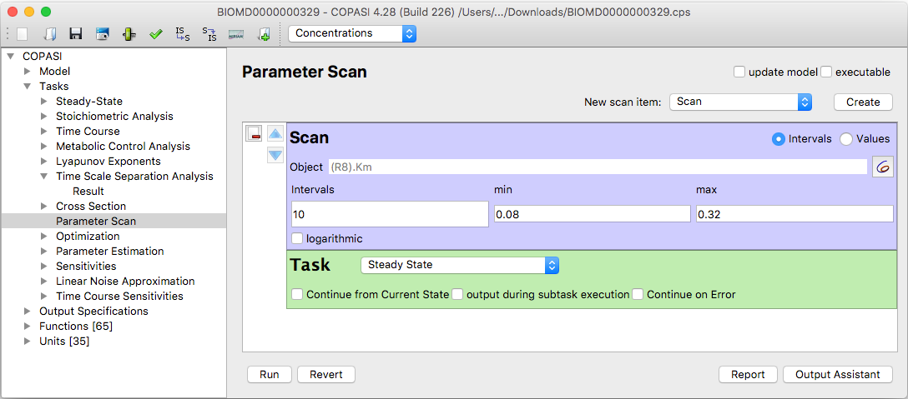
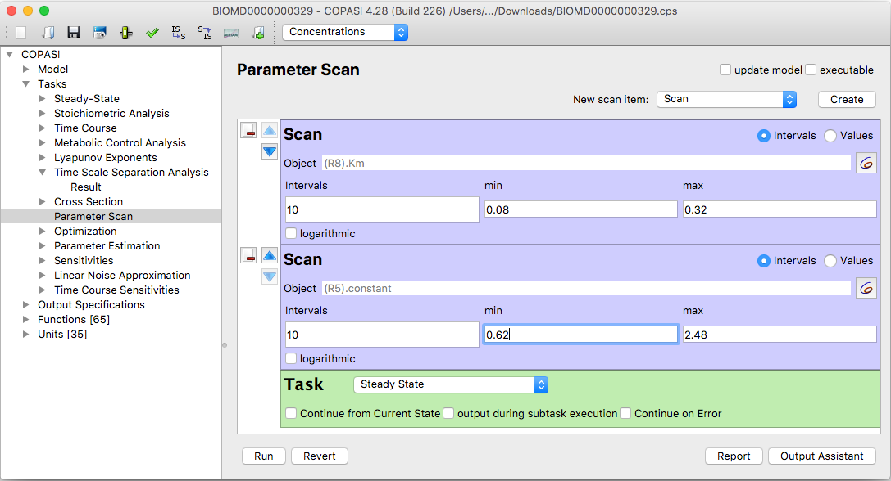
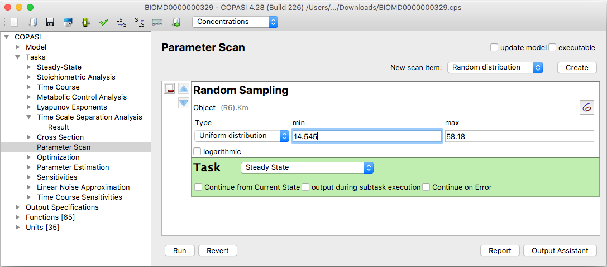
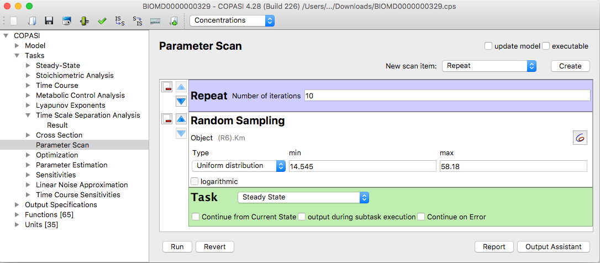
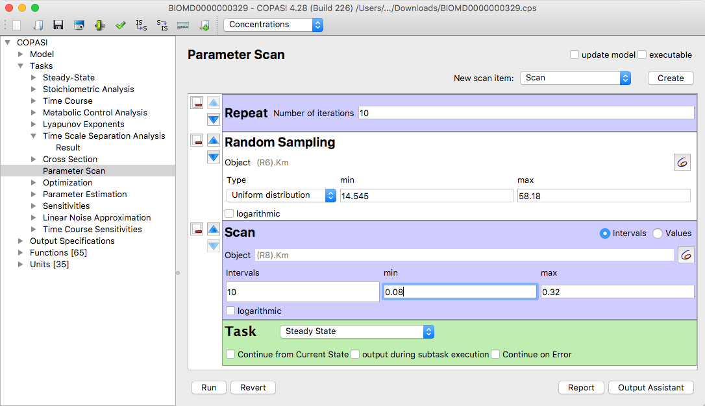
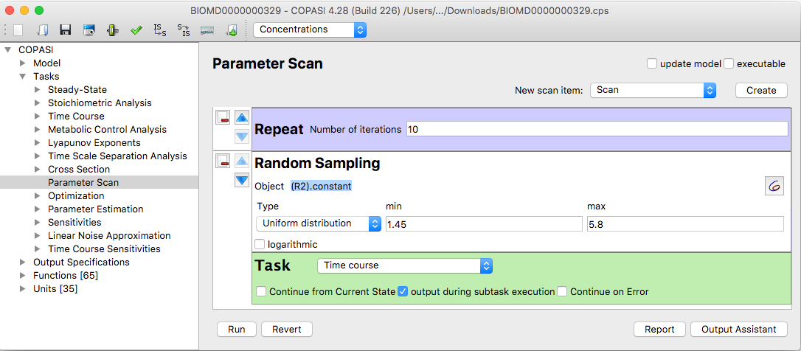
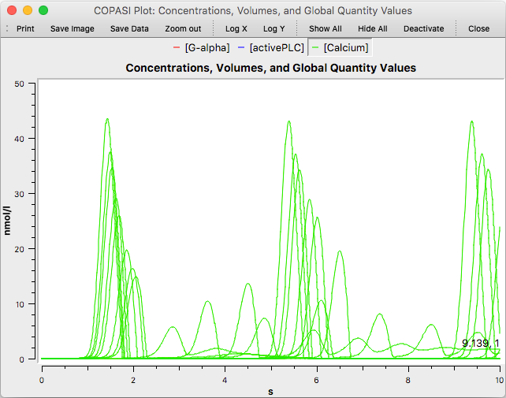
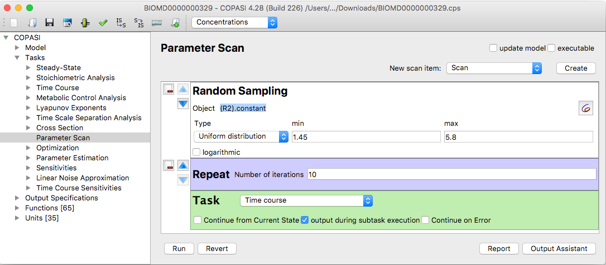
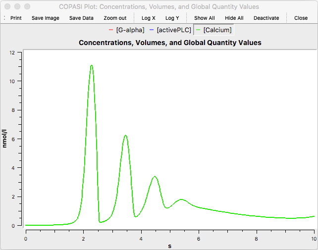

In the object tree, you can find **Parameter Scan** as a branch under **Tasks**. 
At the top of the Parameter Scan dialog, there is a box labeled **New scan 
item** and a **Create** button. The first time you open this dialog, the only 
item shown in the main area is a green box labeled **Task**. This box contains a 
dropdown menu listing all tasks available for scanning. There are also two 
checkboxes: **always use initial conditions** and **output from subtask**.

  <table cellpadding="0" cellspacing="0">
    <tr>
      <td></td>
    </tr>
    <tr>
      <td class="mini">Empty Scan Task Dialog</td>
    </tr>
  </table>
 

The following tasks support parameter scans in COPASI: *Steady-State*, *Time
Course*, *Metabolic Control Analysis*, *Lyapunov Exponents*, *Optimization*,
*Parameter Estimation*, *Sensitivities*, *Linear Noise Approximation*, *Cross
Section*, and *Time Scale Separation Analysis*. For example, if you wish to run a
parameter scan for a time course calculation, select *Time Course* from the task
dropdown menu in the dialog.

At the top of the scan task dialog, you will find a dropdown list with three
entries: *Scan*, *Repeat*, and *Random distribution*. These options allow you to
add different elements to the main scan setup, enabling the construction of
complex scan tasks.

### Scan

Let’s start by reviewing the *Scan* element. By itself, the scan task does
nothing until you specify which parameter to vary. To define a parameter for the
scan, select *Parameter Scan* from the dropdown menu at the top and click the
*Create* button. COPASI will add a new section to the dialog labeled *Scan*. In
the Scan section, you will see input fields, a button for selecting the
parameter, and a checkbox labeled *logarithmic scan*.

  <table cellpadding="0" cellspacing="0">
    <tr>
      <td></td>
    </tr>
    <tr>
      <td class="mini">Scan Task Dialog with Scan Item</td>
    </tr>
  </table>
 

To begin setting up a parameter scan, first select the parameter you want to 
vary. Click the **...** button beside the parameter field, then choose a 
parameter from the selection dialog that appears. Once you have made your 
selection and clicked **OK**, the name of the selected parameter will appear next 
to the **...** button.

Below this, you can specify the **minimum** and **maximum** values that the 
parameter will take during the scan. By default, after selecting a parameter, 
the minimum is set to half the parameter's current value, and the maximum is set 
to double its value. You can adjust these fields as needed.

The **Intervals** field lets you set the number of steps COPASI uses to change 
the parameter from its minimum to maximum value. Finally, the **logarithmic scan** 
checkbox determines whether these increments are in linear (unchecked) or 
logarithmic (checked) steps.

Now you are ready to run a basic scan by clicking the **Run** button at the 
bottom of the dialog. To see the results, you need to define some form of output. 
The scan task can generate reports, and if a plot is defined, it will show 
overlaid plots for each scan step in the plot window. If you do not change the 
number of intervals, COPASI will, by default, run 10 time course simulations with 
different parameter values, resulting in 10 overlaid plots.

If you require output from your parameter scan, you must define an output as 
explained in the [output 
section]({{ site.baseurl }}/Support/User_Manual/Output/). The easiest approach is 
to use the Output Assistant, accessible via the **Output Assistant** button (see 
the [output assistant section]({{ site.baseurl }}/Support/User_Manual/Output/Output_Assistant)). 
To save the output to a file, link your output definition to a file using the 
**Report** button. In the dialog that appears, select an appropriate report, 
choose or browse to a file, and decide whether you want to append to an existing 
file or overwrite it. Click **Confirm** to save your choices. When you run the 
scan task, COPASI will write the results to the file you specified.

This only covers the basics of the scan dialog. To perform a two-dimensional scan 
(i.e., vary two parameters independently), simply add a second **Scan** widget 
to the dialog as you did for the first. Select **Scan** from the dropdown menu 
and click the **Create** button to add another parameter to scan.

  <table cellpadding="0" cellspacing="0">
    <tr>
      <td></td>
    </tr>
    <tr>
      <td class="mini">Scan Task Dialog with 2 Scan Items</td>
    </tr>
  </table>
 

After adjusting the minimum and maximum values, as well as the number of
intervals, you can run the scan task again. COPASI will perform a scan for
the first parameter while holding the second parameter constant at its minimum
value. It will then increment the second parameter and repeat the scan for the
first parameter from its minimum to maximum value. In this way, COPASI performs
a complete scan of the first parameter for each value of the second parameter.
Note that if you select 10 intervals for both parameters, COPASI will run 100
time course simulations during this two-dimensional scan, which may require
considerable computation time.

If you would like the scan item to take on specific values, you can select the
**Values** radio button and then enter a space- or comma-separated list of the
desired parameter values.

### Random Distribution

The *Random distribution* item is similar to the *Scan* item, but instead of
stepping through a range, it assigns a random value to a parameter. After
adding a Random distribution widget to the main dialog, you first select the
parameter to randomize. You can then choose from four distribution types for
generating the random value: *Uniform distribution*, *Normal distribution*,
*Gamma distribution*, or *Poisson distribution*. For the uniform distribution,
you specify the bounds within which the random value should fall. For the normal
distribution, you set the mean and standard deviation. For the Poisson
distribution, you specify the mean. For the gamma distribution, you provide the
shape and scale. Once all settings have been entered, clicking **Run** will set
the parameter to a random value drawn from the chosen distribution and run a
single time course simulation.

  <table cellpadding="0" cellspacing="0">
    <tr>
      <td></td>
    </tr>
    <tr>
      <td class="mini">Scan Task Dialog with Random Distribution </td>
    </tr>
  </table>
 

### Repeat

The **Repeat** item allows you to perform a specific action multiple times.
For example, if you place a Repeat widget above a Random distribution
widget, the chosen parameter will be assigned a new random value for each
iteration, as many times as specified in the Repeat widget. The time
course simulation—or any other task selected in the Task section at the
bottom of the main dialog—will then be executed each time with the new
value.

  <table cellpadding="0" cellspacing="0">
    <tr>
      <td></td>
    </tr>
    <tr>
      <td class="mini">
        Scan Task Dialog with Random Distribution and Repeat Scan Items
      </td>
    </tr>
  </table>
 

You can combine different scan items in various ways to achieve your workflow
goals. For example, to run 10 parameter scans, each with a different random
value for a second parameter, you could use a combination of a **Scan** widget,
a **Random distribution** widget, and a **Repeat** widget.

In the main dialog, you can use the buttons on the left of each item (except
the Task at the bottom) to move items up or down in the list or remove items
you no longer need. The sequence of items matters: COPASI processes actions
from top to bottom, with each widget controlling the one directly beneath it.
This means that where you place a **Repeat** widget relative to other widgets
can change the scan's outcome.

Consider a scenario with both a Repeat widget and a Random distribution widget
in the main dialog. If you place the **Repeat** widget *above* the **Random
distribution** widget, then clicking **Run** will execute the task as many
times as specified in the Repeat widget, assigning a new random value to the
chosen parameter for each run. 

However, if you place the **Repeat** widget *below* the **Random distribution**
widget, clicking **Run** will still repeat the task the specified number of
times, but all repetitions will use the same randomly chosen value for that
parameter. This happens because the random value is selected once, and then
the repeats are performed with that fixed value.

This difference is especially clear in deterministic time course simulations
with a concentration plot: in the first arrangement, you are likely to see X
distinct curves (one for each random parameter value), but in the second case,
you may see the same curve repeated X times.

  <table cellpadding="0" cellspacing="0">
    <tr>
      <td></td>
    </tr>
    <tr>
      <td class="mini">Scan Task Dialog with Combination of Actions</td>
    </tr>
  </table>
 

#### Order matters!

  <table cellpadding="0" cellspacing="0">
    <tr>
      <td></td>
      <td></td>
    </tr>
    <tr>
      <td class="mini">Scan Task Dialog with repeated Random Distribution, Repeat on top!</td>
      <td class="mini">Plot with 10 different Curves</td>
    </tr>
  </table>
 

  <table cellpadding="0" cellspacing="0">
    <tr>
      <td></td>
      <td></td>
    </tr>
    <tr>
      <td class="mini">
        Scan task Dialog with with Random Distribution where Time Course Task is 
        repeated (but the sampling is only done once as the repeat is on 2nd position)
      </td>
      <td class="mini">Plot with 10 identical Curves</td>
    </tr>
  </table>
 

### Checkboxes at the Bottom of the Parameter Scan Task

At the bottom of the Parameter Scan Task widget, you will find three checkboxes
that affect how the scan is executed:

- **Continue from Current State**:  
  If checked, each subtask (such as a simulation or calculation) will start from
  the state left by the previous run. If unchecked, every subtask will start
  from the initial conditions defined in your model.

- **Output During Subtask Execution**:  
  When enabled, COPASI displays or saves the full time course result every time
  a time series task completes. For example, if your scan has 10 time course
  simulations, all ten will be shown or written out, overlaying their results in
  the same plot window. If this box is unchecked, COPASI will only plot or save
  the final result of each subtask—such as the final concentrations after the
  last simulation step. This setting is also used for outputs in report files.
  This feature is especially useful if you wish to plot a calculated result as a
  function of the scanned parameter (e.g., plotting the steady-state value on
  the y-axis versus the scanned kinetic parameter on the x-axis).

- **Continue on Error**:  
  This checkbox determines COPASI’s behavior if an error occurs during one of
  the subtasks (for instance, due to a failed simulation from an unsuitable
  parameter value). If unchecked (default), COPASI will stop the entire scan at
  the first error. If checked, COPASI will skip the failed subtask, continue
  with the other subtasks, and notify you at the end about any that could not be
  completed.
