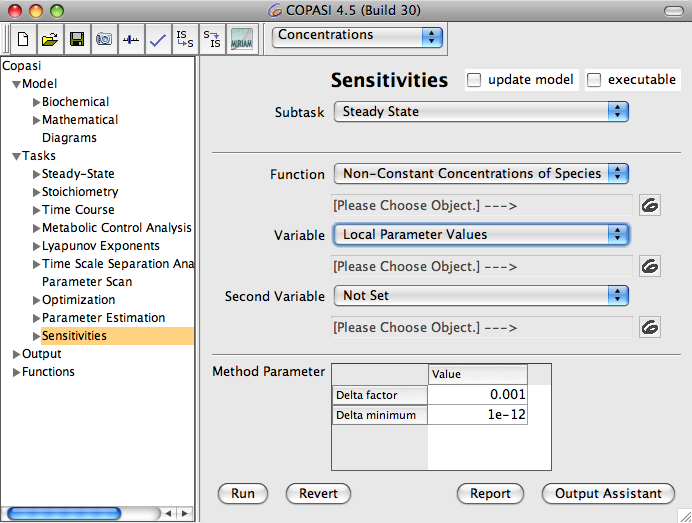
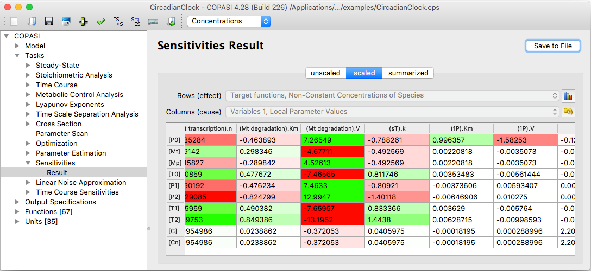

COPASI enables you to calculate the sensitivities of a model with respect to 
various parameters. In general, a *sensitivity* measures how much a specific 
*observable* (that is, any value produced from numerical analysis of the model) 
changes in response to variations in a given parameter.

You can compute arrays of sensitivities for lists of observables with respect 
to lists of parameters. All settings for sensitivity analysis are available in 
the **Tasks → Sensitivities** section.

For example, suppose your model reaches a steady state. You may want to see how 
the steady-state concentrations are affected by different kinetic parameters. To 
perform this analysis in COPASI, you might choose the following settings:

  <table cellpadding="0" cellspacing="0">
    <tr>
      <td></td>
    </tr>
    <tr>
      <td class="mini">Sensitivity&nbsp;Analysis&nbsp;dialog</td>
    </tr>
  </table>

To perform a typical sensitivity analysis in COPASI, select the following
options:

- **Subtask**: Choose **Steady State**. This setting indicates that you are
  interested in the sensitivities of steady state calculation results.
- **Function**: Select **Non-Constant Concentration of Species**. The "Function"
  specifies the observables—here, the steady state concentrations for which you
  want to determine sensitivities.
- **Variable**: Set this to **Local Parameter Values**. Local parameters refer
  to kinetic parameters that are directly specified for the model's reactions.

Once these options are set, click the **Run** button to start the calculation.

  <table cellpadding="0" cellspacing="0">
    <tr>
      <td></td>
    </tr>
    <tr>
      <td class="mini">Sensitivity&nbsp;Analysis&nbsp;result</td>
    </tr>
  </table>

The results of the sensitivity analysis are presented as color-coded tables of
numbers. These tables make it easy to visually interpret how each observable
responds to changes in the selected parameters.

