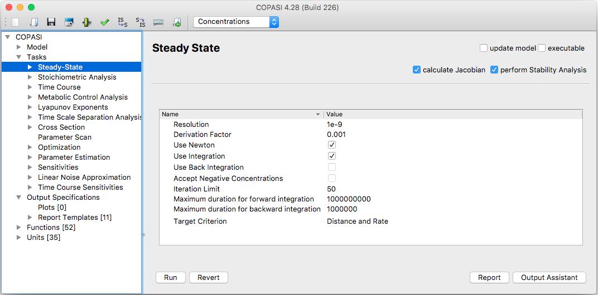
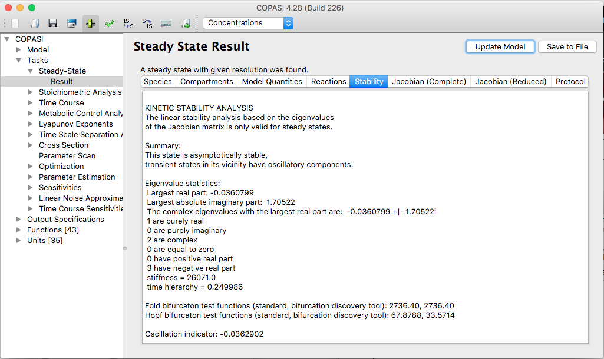

To run a Steady-State analysis in COPASI, go to the **Task → Steady-State**
branch in the object tree.

  <table cellpadding="0" cellspacing="0">
    <tr>
      <td></td>
    </tr>
    <tr>
      <td class="mini">Steady-State&nbsp;Task&nbsp;Dialog</td>
    </tr>
  </table>

In the dialog for the Steady-State task, you can adjust several settings 
that impact how the steady-state analysis is performed. For example, you 
may select whether COPASI should calculate the Jacobian matrix and/or 
perform a stability analysis by checking the relevant checkboxes.

The **Executable** checkbox determines whether the command-line version 
CopasiSE will perform this task when running the associated file.

Within the **Method Parameter** table, you can configure specific settings 
that affect the method COPASI uses to calculate the steady state. For 
detailed information on these, refer to the [relevant method documentation](../../Methods/Steady_State_Calculation/).

To start the calculation, click the **Run** button at the bottom of the 
screen. When the calculation finishes, COPASI will switch to the **Result** 
widget.

The Result widget for Steady-State analysis is organized into several tabs, 
each displaying a specific set of results:

- The **first tab** displays information about the species at steady state.
- The **second tab** shows data for the compartments.
- The **third tab** presents the model quantities.
- The **fourth tab** lists the reactions and their fluxes. You can choose 
  between concentration-based fluxes and particle-based fluxes using the 
  drop-down menu above the tab. You may change this display at any time.
- The **fifth tab** (shown only if Jacobian calculation was requested) 
  shows the Jacobian matrix for the full system, including its eigenvalues.
- The **sixth tab** (also shown only if Jacobian calculation was requested) 
  contains the Jacobian matrix for the reduced system, along with 
  eigenvalues.
- The **seventh tab** displays the stability analysis results if a 
  stability analysis was performed.
- The **last tab** provides a protocol listing the steps COPASI took while 
  attempting to compute the steady state.

Each tab helps you review the various result categories generated during the 
analysis.

  <table cellpadding="0" cellspacing="0">
    <tr>
      <td></td>
    </tr>
    <tr>
      <td class="mini">Results&nbsp;of&nbsp;the&nbsp;Stability&nbsp;Analysis</td>
    </tr>
  </table>

To generate output from the Steady-State Task, you need to create an output 
definition as described in the [Output](../../Output/) section, or you can 
use the default report called *Steady-State*. The default report provides a 
summary stating whether a steady state was found, along with the 
concentration, concentration rate, particle number, particle number rate, 
and transition time for all species, as well as the flux for all reactions. 
If you requested them, the Jacobian matrix and its eigenvalues are also 
included in the report.

For custom output, the easiest approach is to use the Output Assistant, 
accessed via the Output Assistant button. For details on how to use it, 
see the [Output Assistant](../../Output/Output_Assistant/) section.

To save the output to a file, you need to connect the output definition to 
a file. Click the **Report** button to open a dialog that allows you to 
link the report from a specific task to a location on your computer. 
First, select a report suitable for the Steady-State task from the drop-
down menu at the top of the dialog. Then, specify the file where the 
report should be saved by clicking the **Browse** button and selecting the 
destination. By default, COPASI will create a new file or overwrite an 
existing file with the same name. If you prefer to add the output to the 
end of an existing file, select the checkbox labeled **Append** at the 
bottom of the dialog.

Once your selections are complete, click **Confirm**. The next time you 
run the Steady-State task, COPASI will write the output to the file you 
specified.
