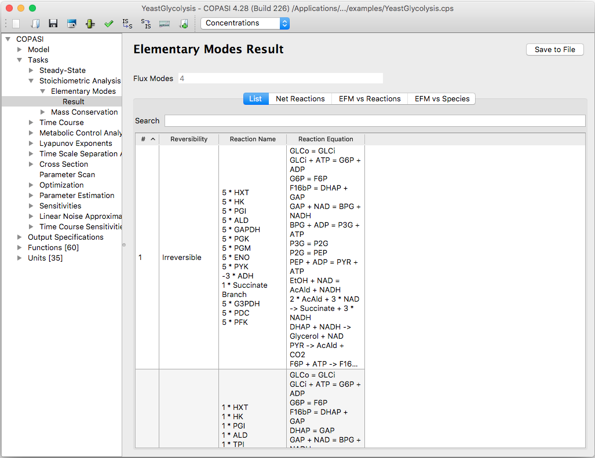

An elementary flux mode (EFM) is a minimal, steady‑state pathway through a metabolic network that cannot be decomposed into simpler functioning pathways.

Calculating elementary flux modes with COPASI is straightforward. To begin, 
select **Tasks → Stoichiometric Analysis → Elementary Modes** in the object tree, then 
click the **Run** button in the dialog window that appears.

The resulting elementary modes will be shown directly in this dialog. Each 
elementary mode displays the reactions it contains, along with their chemical 
equations.

  <table cellpadding="0" cellspacing="0">
    <tr>
      <td></td>
    </tr>
    <tr>
      <td class="mini">Elementary&nbsp;Flux&nbsp;Modes&nbsp;Analysis&nbsp;Dialog&nbsp;with&nbsp;Results</td>
    </tr>
  </table>

If you wish to save the output from your Elementary Mode analysis, you will need 
to create an output definition. Instructions for this can be found in the 
[Manual Definition]({{ site.baseurl }}/Support/User_Manual/Output/Manual_Definition/) 
section. The simplest method is to use the Output Assistant, which you can 
open using the **Output Assistant** button. More details are available in the 
[Output Assistant]({{ site.baseurl }}/Support/User_Manual/Output/Output_Assistant/) 
section.

To write the analysis results to a specific file, connect the output definition 
to a file. Click the **Report** button to open a dialog that allows you to link 
the report from your specific task to a location on your computer. First, select 
a report appropriate for Elementary Flux Modes from the drop-down menu at the 
top. Then, click the **Browse** button and choose your desired destination. By 
default, COPASI will create a new file if it does not exist or overwrite the file 
if it does. Alternatively, you can choose to append the results to an existing 
file by selecting the **Append** checkbox at the bottom of the dialog.

Once you are finished, click **Confirm**. The next time you run the task, COPASI 
will write the output to the file you specified.
