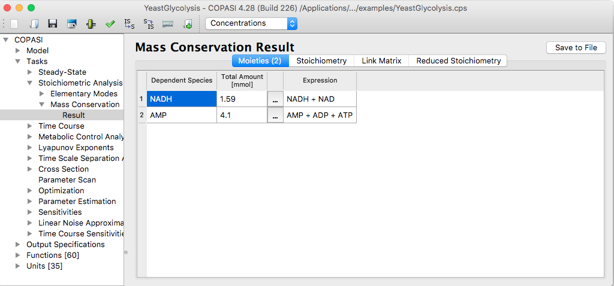
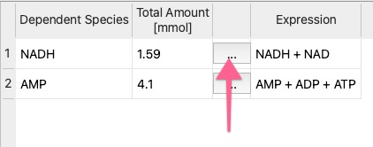

Calculating mass conservations in COPASI is straightforward. To do this, go to
**Tasks → Stoichiometric Analysis → Mass Conservations** in the object tree.
Click the **Run** button as you would for other tasks to start the calculation.

  <table cellpadding="0" cellspacing="0">
    <tr>
      <td></td>
    </tr>
    <tr>
      <td class="mini">Mass&nbsp;Conservation&nbsp;Task&nbsp;Dialog&nbsp;with&nbsp;Results</td>
    </tr>
  </table>

 
 

Moieties are calculated as part of the stoichiometric analysis. The outcome of
this analysis is not unique—it depends on both the algorithm selected and its
implementation. COPASI uses the Householder reduction method, as described in
[Vallabhajosyula06](
{{ site.baseurl }}/Support/User_Manual/Bibliography#Vallabhajosyula06).
For performance, COPASI relies on platform-specific libraries, so the results
may vary between systems such as Windows and macOS. These variations are not
problematic; the moieties form a basis for the linearly dependent subspace of
the system, and the choice of basis is, by nature, not unique.

Often, users are interested in the total conserved amount of a given moiety.
Because moiety definitions can differ depending on the calculation, COPASI
offers a straightforward way to generate a global quantity (of type "assignment")
to compute this value. This function is available via the tool button. 

  <table cellpadding="0" cellspacing="0">
    <tr>
      <td></td>
    </tr>
    <tr>
      <td class="mini">Tool button for creating assignment rules</td>
    </tr>
  </table>

 
 

The resulting assignment is independent of the specific algorithm used for moiety
calculation.

