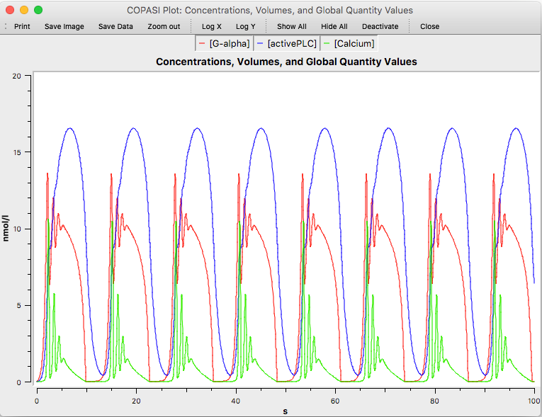

If you have set up an active plot before running a trajectory calculation, COPASI
will automatically display the plot. The plot window consists of three main
components:

- **Toolbar**: Located at the top, the toolbar allows you to print the plot,
  save the data to a file, adjust axis scaling, or deactivate the plot so it does
  not launch automatically when running the task.

- **Legend**: The legend is interactive. You can toggle the visibility of
  individual curves by clicking on their corresponding entries.

- **Plot Area**: This displays the actual graphical representation of your data.

  <table cellpadding="0" cellspacing="0">
    <tr>
      <td></td>
    </tr>
    <tr>
      <td class="mini">Plot&nbsp;Window</td>
    </tr>
  </table>

When you move the mouse cursor inside a plot widget, its coordinates, relative to
the plot’s coordinate system, are displayed next to the cursor.

To zoom in on a specific area of the plot, click and drag to select a
rectangular region. The plot will automatically zoom in to focus on the selected
area. To return to the original view, right-click within the plot area.

Warning: When no 2nd mouse button is available, or you are using touchpads without buttons, use CTRL-click. 

