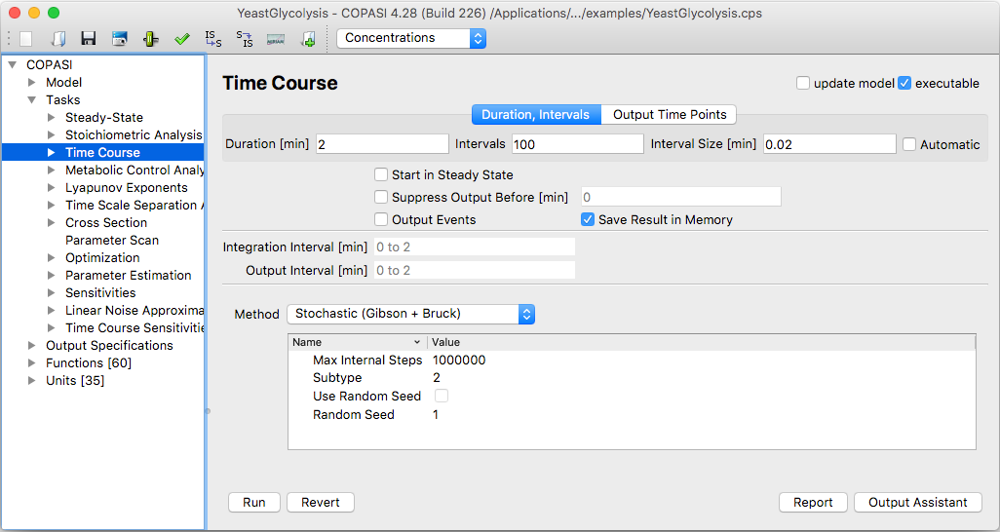
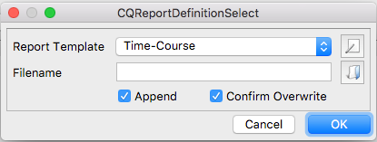
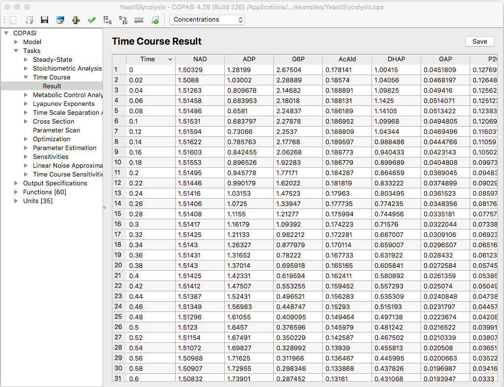

To perform a time course simulation in COPASI, navigate to the **Tasks → Time
Course** section in the object tree.

  <table cellpadding="0" cellspacing="0">
    <tr>
      <td></td>
    </tr>
    <tr>
      <td class="mini">Trajector&nbsp;Task&nbsp;Dialog</td>
    </tr>
  </table>

In the **Time Course** widget, you can configure several parameters related to 
the simulation. For example, you can change the simulation's total duration or 
set the number of intervals into which the time range is divided. 
Alternatively, you may specify the interval size directly; when you edit either 
the number of intervals or the interval size, the other value updates 
automatically. If you adjust the total duration, the number of intervals will 
remain the same and the interval size will change accordingly.

If you prefer to let the integrator automatically choose the step size, you can 
check the **Automatic** box. Alternatively, you may explicitly provide a list 
of times (space- or comma-separated) at which you want output from the solver.

The checkbox labeled **Save Result in Memory** tells COPASI to store the results 
of the time course simulation in memory for display in the result dialog. 
Because these results can consume significant memory, especially for larger 
models or high numbers of steps, you should consider disabling this option if 
system memory may be insufficient. If you disable this option, you must 
[define a report](../../Output/Manual_Definition/Reports/) to save the results.

Another adjustable setting in this dialog is the *Start Output Time* option. 
By default, COPASI records output across the entire simulation time; plots, 
reports, and the result dialog will reflect all time points calculated. If you 
only want to save simulation results after a certain time, activate the delayed 
checkbox and specify the time delay in the field provided. For example, if you 
simulate for 100 seconds but are only interested in the last 50 seconds, set a 
delay of 50. Outputs generated before this time will be discarded from all types 
of output.

The time course simulation is not forced to start at ${t}_{0} = 0$. Instead, 
the simulation begins at the initial model time, which is set in the 
[General Model Settings dialog](../../Model_Creation/General_Model_Settings/).

#### Simulation Methods
COPASI offers six different methods for time course simulation. For 
deterministic simulation, you may select the **LSODA** solver or its variant 
**LSODAR**. Stochastic time course simulations can be carried out using either 
the **Gibson and Bruck** method or the **Tau-Leap** method. Depending on your 
selected solver, several method-specific parameters are available in the table 
of parameter values. Detailed explanations of these parameters can be found in 
the methods section.

Beyond purely deterministic or stochastic simulations, COPASI also provides a 
hybrid method that combines both approaches. The hybrid method partitions the 
model based on particle counts in each reaction: reactions with many particles 
are handled deterministically, while those with few particles are simulated 
stochastically. Users can set the threshold that determines this division. 
Depending on your model, the hybrid approach may offer significant speed 
improvements over fully stochastic simulation, while maintaining greater 
accuracy for low particle number systems than a strictly deterministic 
approach. Note, however, that this method is still considered experimental. 
For more details, see the relevant methods documentation.

Three hybrid solver variants are available: the first uses **LSODA** for deterministic 
integration (*Hybrid (LSODA)*), and the second uses fourth-order 
Runge-Kutta integration (*Hybrid (Runge-Kutta)*), and another *Hybrid (RK-45)* supports events and specific partitioning. 

Finally, simulation using Stochastic Differential Equations can be done, choosing 
the *SDE Solver (RI5)*.

See also all [Time Course Methods](../../Methods/Time_Course_Calculation/).

#### Report Definition

If you have not yet created a report definition, you can use the output 
assistant by clicking the button at the bottom of the time course dialog. After 
you [create a report definition](../../Output/Manual_Definition/Reports/), you must associate it with an 
output file for COPASI to save results. This is done from the **Report** 
button in the time course dialog.

  <table cellpadding="0" cellspacing="0">
    <tr>
      <td></td>
    </tr>
    <tr>
      <td class="mini">Dialog&nbsp;to&nbsp;associate&nbsp;a&nbsp;Report&nbsp;with&nbsp;a&nbsp;File</td>
    </tr>
  </table>

When the dialog opens, you can select which report to use (useful if you have 
created more than one), and browse to choose a file in which to save the 
report. You can also decide whether to append the report to an existing 
file, by default, COPASI will create a new file or overwrite an existing file, 
unless you check the **Append** checkbox.

After you have set all desired parameters, start the time course simulation by 
clicking **Run**. COPASI will display a progress bar during the simulation; 
the duration depends on factors such as your hardware, the method chosen, and 
the size of your model. When finished, results will appear in the report file 
you specified and, if you opted to keep results in memory, in a separate result 
dialog as well.

#### Result Dialog

The **Result** dialog is found just below the **Time Course** branch in the 
object tree. Here, you can choose whether to display results as concentrations 
or particle numbers, and you can also save the results to a file. The key 
advantage of using a report over saving results from the Result dialog is 
customization: with a report, you can select exactly which species 
concentrations to include, whereas the Result dialog always saves all species 
concentrations in a fixed order, which cannot be changed during saving.

  <table cellpadding="0" cellspacing="0">
    <tr>
      <td></td>
    </tr>
    <tr>
      <td class="mini">Trajectory&nbsp;Task&nbsp;Results</td>
    </tr>
  </table>

 
 
