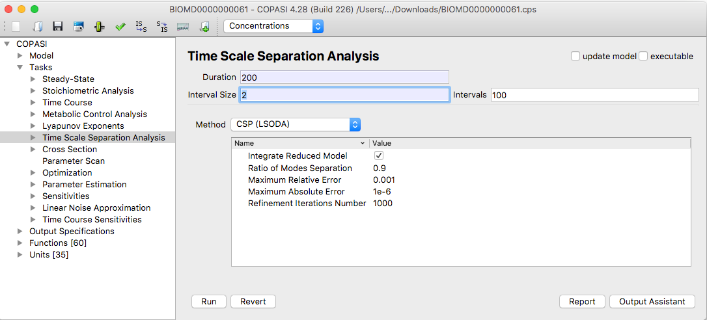
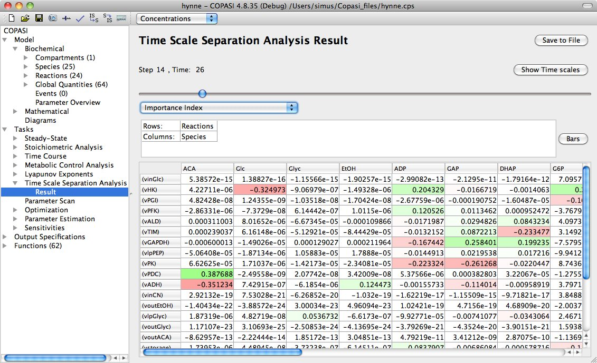
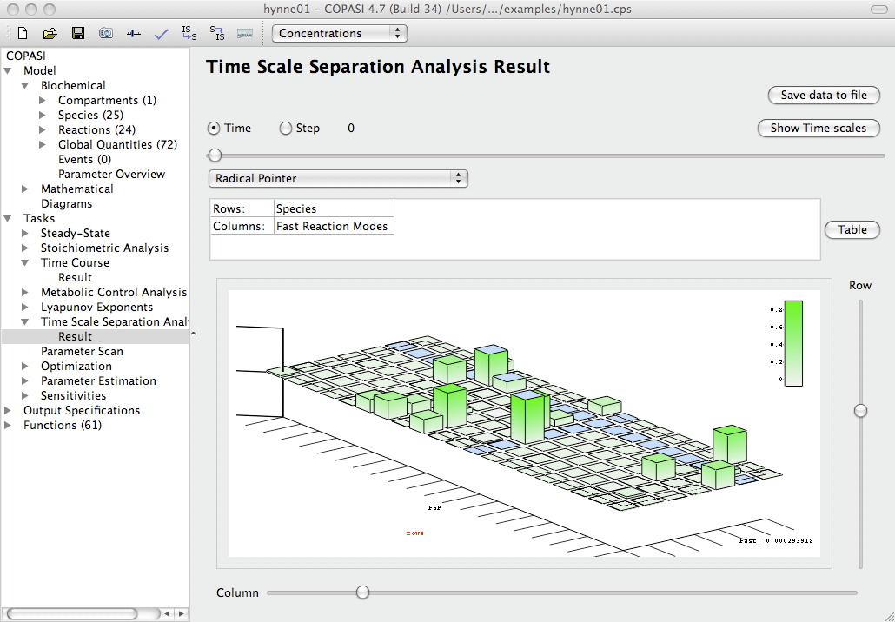
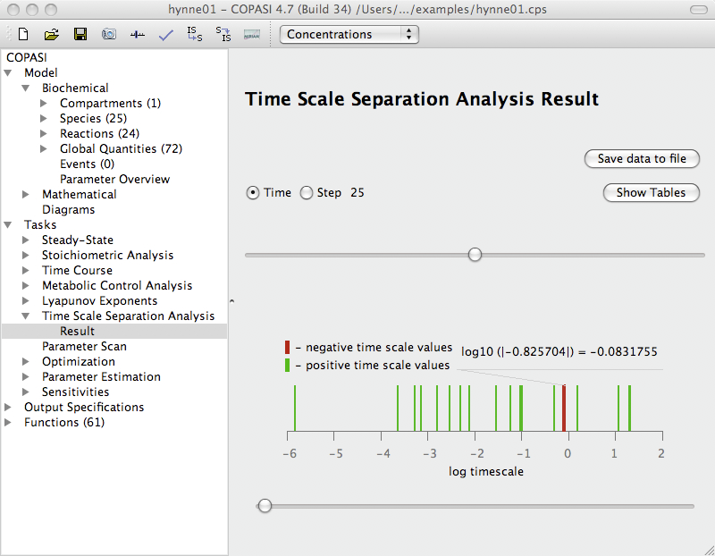

To access the Time Scale Separation Analysis (TSSA) task in COPASI, go to the
**Tasks** branch in the tree view on the left side of the interface and select
**Time Scale Separation Analysis**. This will open the dialog for configuring
and running the analysis.

  <table cellpadding="0" cellspacing="0">
    <tr>
      <td></td>
    </tr>
    <tr>
      <td class="mini">TSSA&nbsp;Task&nbsp;Dialog</td>
    </tr>
  </table>

### Available Methods

The Time Scale Separation Analysis (TSSA) task in COPASI implements three
methods:

- *ILDM (LSODA, Deuflhard)*
- *Modified ILDM (LSODA)*
- *CSP (LSODA)*

These methods are designed to leverage the wide range of characteristic
time scales found in biological systems. Each is based on a local analysis
of the Jacobian matrix of the underlying ODEs, which is partitioned into
fast and slow components at the start of an interval chosen by the user.

Depending on your chosen method, you can adjust several parameters in the
**Parameter value** table that influence how the analysis is performed. You
can find detailed explanations of each method and its parameters in the
methods section of this manual. Each method provides *local* information at
a specific time point. To gain a *global* picture of system behavior, you
should analyze multiple time points throughout your interval of interest.

For this, you must set the **Duration** and either the **Interval size** or
the number of **Intervals**. This is similar to performing a [time course
simulation](../Time_Course_Simulation/). All three methods
rely on numerical integration using the LSODA solver
[[Petzold83]](../../Bibliography#Petzold83).
LSODA settings are set to their default values for this task and are not customizable; for details
see the [deterministic simulation method](../..//Methods/Time_Course_Calculation/Deterministic_Simulation).

If you have not yet
[created a report definition](../../Output/Manual_Definition/Reports/), you may use the
output assistant (accessible at the bottom of the TSSA task widget) to
quickly set one up. You must also associate the report definition with an
output file, which is done by clicking the *Report* button.

Once all parameters are set, you can start the calculation by clicking the
*Run* button. COPASI will show a progress bar during the simulation, which
may take longer depending on your hardware, selected method, and model
size. When the calculation finishes, the Results dialog is found just below
the Time Scale Separation Analysis branch in the object tree. Use the time
slider in the results widget to examine results at different time points.

By default, results are displayed in the graphical user interface as
tables. Positive numbers appear in varying shades of green; negative
numbers are shown in shades of red. This visual coloring aids in quickly
interpreting the results.

  <table cellpadding="0" cellspacing="0">
    <tr>
      <td></td>
    </tr>
    <tr>
      <td class="mini">
        An&nbsp;example&nbsp;of&nbsp;results&nbsp;table&nbsp;Importance&nbsp;Index&nbsp;in&nbsp;CSP(LSODA)&nbsp;method
      </td>
    </tr>
  </table>

This makes it easy to quickly identify the most important contributions and
analyze how the values are distributed. You can save these tables to a text
file by clicking the **Save to File** button.

To visualize the results as interactive three-dimensional bar graphs, click the
**Bars** button. COPASI uses the [Qt5 Q3DBars](https://doc.qt.io/qt-5/q3dbars.html)
library for these plots. You can rotate the view by holding down the right
mouse button. Right-clicking also opens options for slicing the data or
changing the color scheme.

  <table cellpadding="0" cellspacing="0">
    <tr>
      <td></td>
    </tr>
    <tr>
      <td class="mini">
        An&nbsp;example&nbsp;of&nbsp;bar&nbsp;graph&nbsp;visualization&nbsp;of&nbsp;the&nbsp;Radical&nbsp;Pointer&nbsp;in&nbsp;CSP(LSODA)&nbsp;method
      </td>
    </tr>
  </table>

The bar graphs are interactive: you can rotate and zoom them for better 
visibility. Additionally, you can highlight individual rows or columns in the 
tables to focus on specific data.

An extra diagram, available by clicking the **Show Time Scales** button, 
visualizes how the system’s time scales are distributed at a chosen time point.

  <table cellpadding="0" cellspacing="0">
    <tr>
      <td></td>
    </tr>
    <tr>
      <td class="mini">An&nbsp;example&nbsp;of&nbsp;the&nbsp;time&nbsp;scale&nbsp;distribution&nbsp;graph</td>
    </tr>
  </table>

The analysis of how time scales evolve throughout a simulation can provide valuable
insights into the system's dynamics. For more details on this approach, see
[Model Analysis by means of Time Scale Separation](../../Methods/Time_Scale_Separation_Methods/).

Fast, dissipative time scales are associated with eigenvalues of the Jacobian
that have large negative real parts. Explosive modes correspond to positive
eigenvalues. When time scales are equal, this typically results from pairs of
complex conjugate eigenvalues, which indicate the presence of oscillatory
components within the system.
