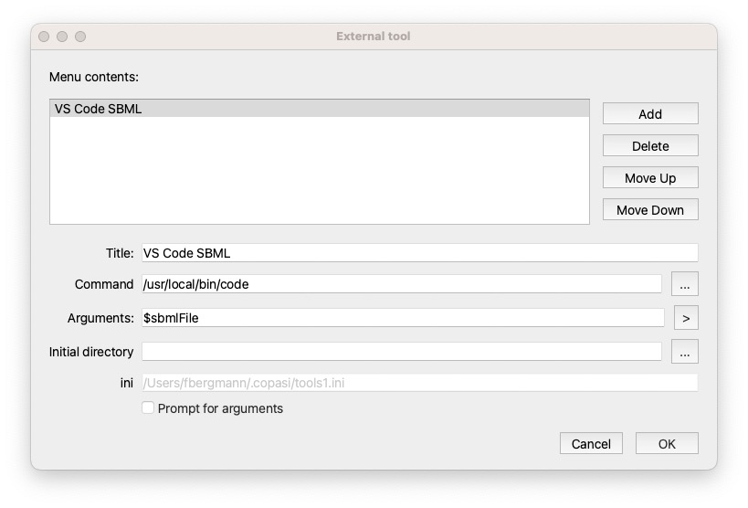

Sometimes you just want to interface with 3rd party tools, and just take the current COPASI model with you. For that we added `External Tools` to the `Tools` menu. Initially, all you will see, is the entry `External Tools...`. When you click it the following dialog will open: 



Here you can `Add` new tools, after a click on add, a new entry will be added to the list, and when you select it you can modify the arguments below. `Delete` will delete the selected entry. 

The individual settings are: 

* `Title`: the menu entry to use.
* `Command`: command to execute, ideally it is the full path to the executable to use. 
* `Arguments`: the command line arguments you want to pass along to the command. There are a couple of placeholders you can use, they'll be added automatically if you press the ` > ` button. 

  * `$sbmlFile`: the current model will be exported to a temporary SBML file, the path of which will be given to the external tool. Optionally you can specify the SBML Level and Version to be exported for the tool, for an SBML Level 3 Version 2 file that would be `$sbmlFileL3V2`.
  * `$cpsFile`: the current model will be saved as a temp COPASI file that will be passed along to the tool.
  * `$omexFile`: the current model will be exported as temporary COMBINE archive and oassed along to the external tool.
  * `$copasiExecutable`: Sometimes it is useful for the external tool to know what application was calling it. Adding the copasi executable flag, will pass this executable along, so the external tool could launch a new instance of it with the changed document. 
  * `ini`: just notes where the information was stored in. 
  * `Prompt for arguments`: if checked, you can modify the command line after the tool is launched.

> **NOTE**: As indicated, all the files generated are temporary files. Please ensure that you save the files if necessary somewhere else. Also the external tool should take care of the files when no longer needed.

### Integrating tools

The external tool dialog loads all `tools*.ini` files from the `$HOME/.copasi/` (macOS / Linux) or `%USERPROFILE%\\.copasi\\` (windows) folder. The format looks something like: 

```ini
[ExternalTool]
name=VS Code SBML
command=/usr/local/bin/code
arguments=$sbmlFile
workingDirectory=
promptForArguments=false
```

to add a tool you could just place such an ini file into the folder, and COPASI will pick it up.

> **NOTE**: when using the dialog, COPASI will modify all ini files, reordering them according to the order chosen in the `Menu contents` list (that is modified using the `Move Up` / `Move Down` buttons)

So to uninstall a tool, delete the tool file with the command to the application to be deleted.