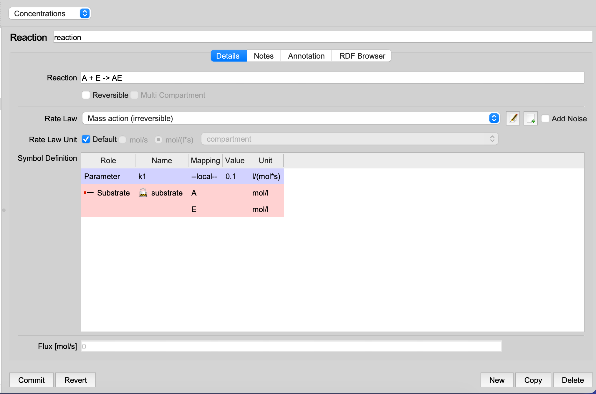
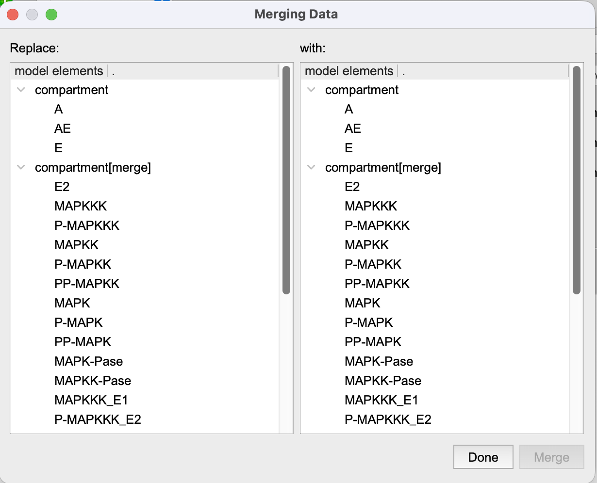
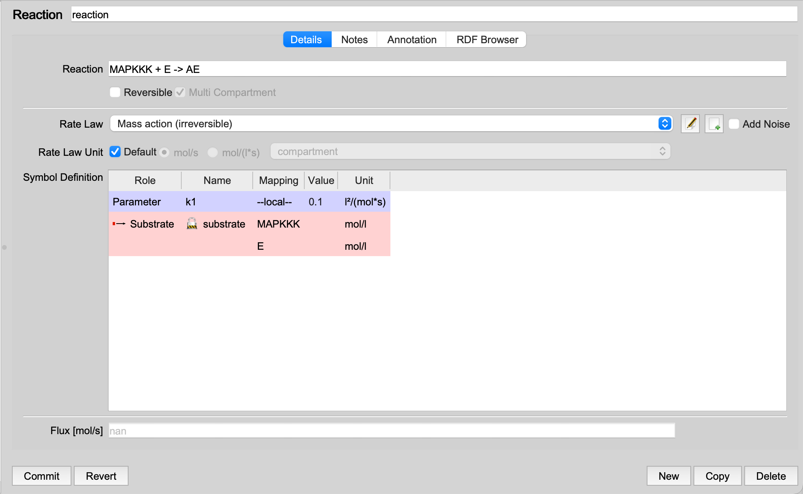

The "Merge Added Model" tool in COPASI enables users to merge different 
submodels within a project. To demonstrate the core functionalities, 
consider the following example.

First, create a simple decay model in COPASI by adding the reaction 
`A + E -> AE` within the Reactions section (`Model -> Biochemical -> 
Reactions`), using the default settings. Next, add another model by 
selecting the "Add to model" tool, either from the GUI elements or via 
`File -> Add to model`. In this example, load the sample `.cps` file 
"MAPK-HF96-layout" (`File -> Examples -> Copasi Files`). You'll observe 
that the reaction `A + E -> AE` is independent of the reactions present in 
the example file, which are located in different compartments.

  <table cellpadding="0" cellspacing="0">
    <tr>
      <td></td>
    </tr>
    <tr>
      <td class="mini">Reaction before merging</td>
    </tr>
  </table>

Suppose we want to merge our simple model with the "DimericMWC-stiff" model, 
replacing species `A` with `MAPKK`. To do this, click on "Merge Added Model" 
(`Tools -> Merge added model`). A new window will open for model merging.

  <table cellpadding="0" cellspacing="0">
    <tr>
      <td></td>
    </tr>
    <tr>
      <td class="mini">Merging added elements, by identifying what is the same in both models.</td>
    </tr>
  </table>

By default, COPASI uses various fonts for clarity: the most recently added 
model appears in italics, and entities that are completely independent 
(typically assignments) are displayed in grey since their merging will have 
minimal impact. 

To merge species, select `A` in the left column and `MAPKK` in the right 
column. After this selection, if you review the reactions, you will notice 
that COPASI has replaced all occurrences of `A` with `MAPKK`. Consequently, 
the reaction now reads `MAPKK + E -> AE`.

  <table cellpadding="0" cellspacing="0">
    <tr>
      <td></td>
    </tr>
    <tr>
      <td class="mini">Reaction after merging</td>
    </tr>
  </table>

It is important to note, however, that replacing `A` with `MAPKK` not 
only renames the species but may also result in the reaction spanning 
multiple compartments, based on the original compartment locations. In 
such cases, you may wish to merge the involved compartments as well to 
ensure the reaction occurs within a single compartment.

Example files: [before](./Example-Merge-beforemerging.cps) | [after](./Example-Merge-aftermerging.cps)