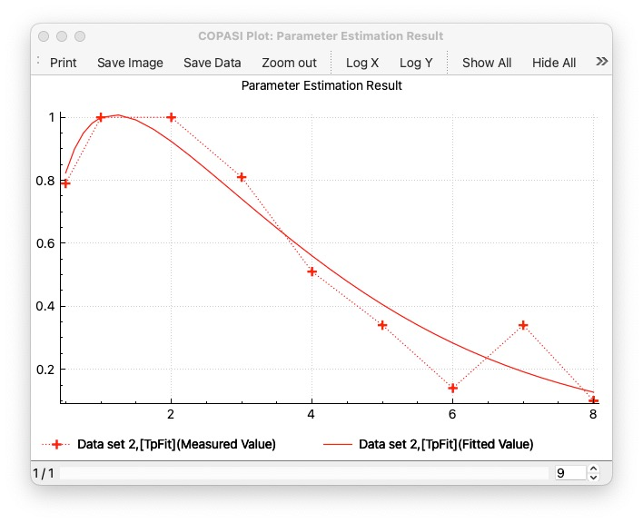
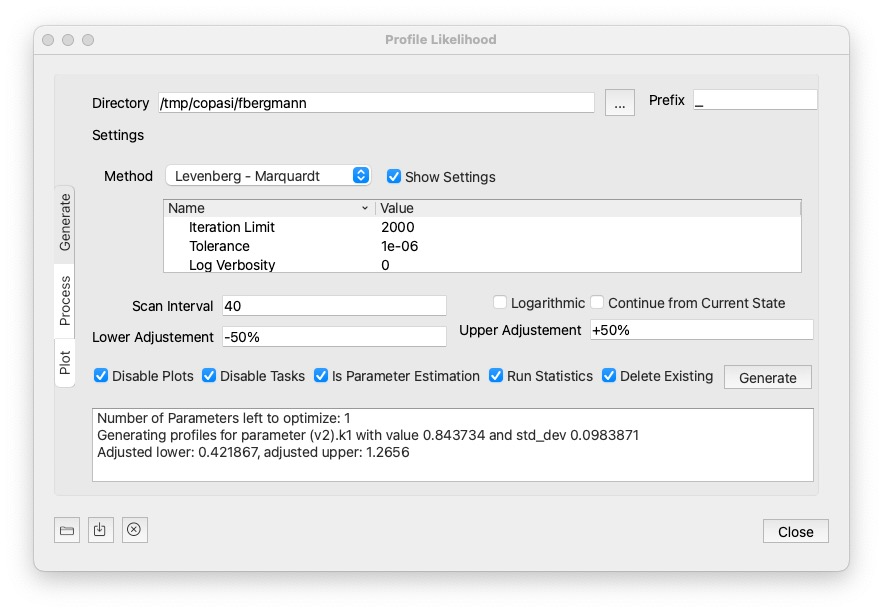
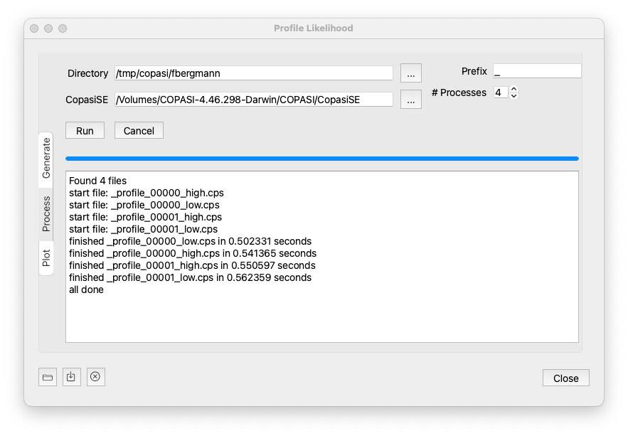
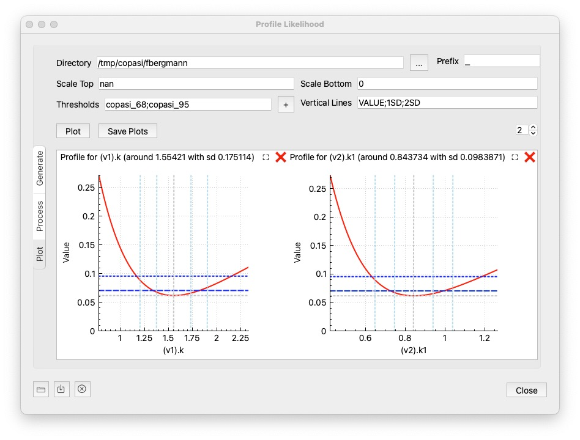

Here, we describe the profile likelihood method implemented in COPASI. This is something, you will want to do to ensure, that the parameters found in your parameter estimation task, are identifyable. The basic approach follows [Schaber's approach](https://www.sciencedirect.com/science/article/pii/S0303264712001670), where starting from a good fit, you create parameter scans around the best value found for a given parameter, while reoptimizing the remaining parameters. If the fit was the best one found, than going away from teh best value would increase the objective value on either direction. If we find a flat line, that means the parameter is not identifiable, if we find a curve that is flat on one side, we can only identify the corresponding bound.

The first step, is to use a model, that already has a good fit. This documentation describes it on Schaber's example, that you also find as COMBINE archive: [schaber2.omex](./schaber2.omex). When you run it and plot a parameter estimation result you would see a plot like this: 

The tool implements the three steps of the approach of: 

* generating different copasi models for each of the scans. (these files could then be moved to a cluster environment for parallel computation)

* running the the scans (if you dont run the files on the cluster)

* plotting the result, by specifying the directory where the reports have been stashed.

### Start the process
Once you have a model with a good fit, select `Profile Likelihood` from the `Tools` menu. The following dialog comes up:

### Generate

**Generate** is the first step, generating all COPASI files (2 files per parameter to be estimated.). Once the files are generated, you would then take them from the folder where and run them on your compute cluster using `CopasiSE`. Or you could use the `Process` section of the dialog on the next page. When generate is pressed this will also saves the settings used in the target directory as `<prefix>settings.json`. That can be loaded back in using the load button at the bottom left corner. It will also store `<prefix>info.json` with the information about the run needed to plot the results later.

Settings: 

* **Directory**: The directory in which to create the files. (if it does not exist, it will be created.) Note that if `Delete Existing` is checked, files matching the prefix in the specified directory will be deletd prior to hitting `Generate`. It defaults to a temp folder, but you can specify any folder you want using the `...` button next to it. 
* **Prefix**: The prefix that all files generated will have. 
* **Method**: Here you choose the optimization algorithm and its settings. The recommendation is to use local methods (like Levenberg Marquardt, Nelder - Mead, Hooke & Jeeves), but all methods can be chosen. Since we expect to be close to the optimal value already, it is ok, to lower the iteration limit quite a bit. 
* **Scan Interval**: The number of scan intervals, that the parameter scan will take to get away from the best value found. Note that for each parameter, we create 2 files. So if you specify a scan interval of `40`, then the first file will take 40 steps into the lower direction, and 40 steps into the upper direction. 
* **Logarithmic**: whether to use logarithmic steps 
* **Continue from Current State**: whether to continue from current state, from one parameter estimation to the next. It could save some steps on a local method. 

* **Lower Adjustement** / **Upper Adjustment**: How to modify the parameter value. Note that the lower value will have to be lower than the current value for the parameter. And the upper value higher than the current value. There is a number of way to specify how to modify the values:

    * `explicit number`: You could specify the value direction. So a value of `0.1` would set the corresponding bound to that value directly. 
    * `+/- <value>%`: Specify a percentage of the current parameter value. For example: `-50%` would half the parameter value.  
    * `* <value>`: multiply the current parameter value witht the specified value.
    * `+/-<value>SD`: adds / substracts multiples of the standard deviation from the current parameter value. This is only working if standard deviations can be computed for the model.

* **Disable Plots**: disables all other plots in the generated files
* **Disable Tasks**: disables all other tasks
* **Is Parameter Estimation**: The method is usually used for Parameter Estimation, but in theory could be used for optimization as well. If checked, it is assumed to be a parameter estimation.
* **Run Statistics**: whether to compute the statistics before the run.

* **Delete Existing**: If checked, when `Generate` is clicked the files starting with the specified prefix will be deleted from the specific directory.

### Process

If you dont want to run the generated files on your cluster environment, this section of the dialog will process all the files using `CopasiSE`. This will launch CopasiSE with each file, which just executes the task marked as `scheduled`. (So you could use it for all other files with scheduled tasks.)

Settings: 
* **Directory**: The directory that contains the files to process. It defaults to the same folder as used by generate, but you can specify any folder you want using the `...` button next to it. 
* **Prefix**: The prefix the files to run. 
* **CopasiSE**: The file to the CopasiSE executable to run. It defaults to `CopasiSE`, but sometimes it cannot be run directly from the Path, so you might have to locate it directly. 
* **#Processes**: Number of processes to exeute simultaneously. Defaults to 4. 

A click on `Run` will then process all files matching the prefix, and maching `profile_*.cps`. You will get notifications in the text widget beneath.

To stop all currently running processes, hit the cancel button. 

Once the files are processed it will print `all done`. But you do not need to wait for all the computations to succeed, you could go to the plot widget. 

### Plot

Once the results have been computed on the cluster environment, or computed using process from the last step. This option allows you to plot the results. Just specify the directory and click the  `Plot` button. 

Settings:

* **Scale Top**: sets the maximum value of the y axis if specified. If set to `nan`, the max value obtained from the report files will be used. 

* **Scale Bottom**: the minimum value of the y axis to display. defaults to 0. If set to `nan` the min value obtained from the reports will be used. 

* **Tresholds**: semicolon separated list of horizontal lines to be plotted, so you get a visual clue if the parameters are below a value you favor. There are a number of options that you could choose: 

    * `value`: if you specify a number, the horizontal line is plotted there. 
    * `copasi_68`: 68% confidence, 1 parameter
    * `copasi_95`: 95% confidence, 1 parameter
    * `schaber_chi2_1p`: Schaber chi^2 for 1 paramter
    * `schaber_chi2_p`: Schaber chi^2 for m paramters
    * `schaber_fratio_p`: Schaber F for m paramters
    * `donaldson_fratio_1p`: Donaldson F for 1 paramter
    * `value%`: percent of the objective value reached

* **Vertical Lines**: semicolon separated list of vertical lines to be plotted. Possible values are: 
    * `VALUE`: the original best parameter value
    * `number`: a value at which you want to see a vertical line
    * `<value>SD`: a standard deviation at wich you want to see a line, for example `1SD` would plot a line at +1 and -1 standard deviation around the value
    * `value%`: a percentage of the best parameter value

Optionally, you can save the created image using the `Save Plots` button. The number control at the right side specifies how many plots are displayed per row. As there might be quite a number of parameter plots, you can close or pop out individual ones: 

    - ❌: closes the individual plot (you can always re-create them hitting the plot button again)
    - ⛶:  will open the plot in a separate dialog

For full control of what is being displayed on each plot, you can right click on it, enable the legend, and toggle on or off individual curves.